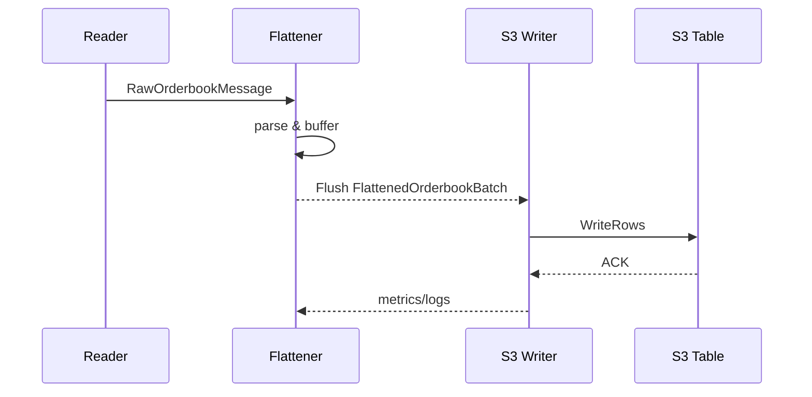

# CryptoFlow

CryptoFlow is a Go service that streams high‑frequency order book snapshots from exchanges and stores them as Parquet files in S3.  The reference implementation ships with a Binance futures reader and is designed to run continuously with minimal operational overhead.

---

## Architecture and Data Flow

```
┌─────────────┐   RawOrderbookMessage    ┌─────────────┐   FlattenedOrderbookBatch   ┌───────────┐
│ Binance API │ ───────────────────────▶ │   Reader    │ ───────────────────────────▶ │ Flattener │
└─────────────┘                         └─────────────┘                               └─────┬─────┘
                                                                                         │
                                                                                         ▼
                                                                                ┌────────────┐
                                                                                │  S3 Writer │
                                                                                └────────────┘
```

1. **Reader** – polls the Binance depth endpoint at the configured interval and emits a `RawOrderbookMessage`.
2. **Flattener** – converts each message into a `FlattenedOrderbookBatch`, expanding bids and asks into individual price levels.
3. **S3 Writer** – buffers batches per `exchange/market/symbol` and periodically flushes them to an Amazon S3 Table as Parquet files.
4. **Channels** – provide back‑pressure aware communication between stages and expose lightweight metrics.

### Channels

| Channel | Direction | Data Type | Description |
|---------|-----------|-----------|-------------|
| `RawMessageChan` | Reader ▶ Flattener | `models.RawOrderbookMessage` | Full order‑book snapshot including timestamp, last update ID, bids and asks. |
| `FlattenedChan` | Flattener ▶ S3 Writer | `models.FlattenedOrderbookBatch` | Batch of flattened entries (`Exchange`, `Market`, `Symbol`, `Timestamp`, `LastUpdateID`, `Side`, `Price`, `Quantity`, `Level`). |

---

## Repository Layout

```
CryptoFlow/
├── config/                # configuration loading and validation
├── internal/              # channel definitions and monitoring
├── logger/                # zerolog wrapper
├── models/                # order book message and batch structs
├── processor/             # flattener implementation
├── reader/                # Binance futures depth reader
├── writer/                # S3 parquet writer
├── main.go                # application entrypoint
├── config.yml             # runtime configuration
├── .env.example           # sample AWS credentials
└── ...
```

---

## Configuration

All runtime options live in `config.yml`.  Key sections:

- `cryptoflow`: service name and version.
- `channels`: buffer sizes for the raw and flattened channels.
- `reader`: concurrency and retry controls for the exchange client.
- `processor`: batch size and timeout for the flattener.
- `source`: exchange endpoints to poll (e.g. `binance: future: orderbook`).
- `storage.s3`: toggle and tune S3 table writes (`flush_interval`, `partition_format`, compression, etc.).
- `logging`: level, format and output destination.

Sensitive S3 credentials are not stored in YAML.  Provide them through an `.env` file or the environment:

```
AWS_ACCESS_KEY_ID=...
AWS_SECRET_ACCESS_KEY=...
AWS_REGION=...
S3_BUCKET=...
S3_TABLE_ARN=...
```

`S3_TABLE_ARN` must reference the Amazon S3 table you created (for example `arn:aws:s3tables:REGION:ACCOUNT:tablebucket/BUCKET/table/default/s3-table`). Ensure your IAM user has `s3tables:*` permissions to update the table metadata.

Copy `.env.example` to `.env` and populate with your values before running the application.

---

## Running

```bash
# Install dependencies and run tests
go build ./...
go test  ./...

# Start the service (uses config.yml by default)
go run main.go
```

On startup CryptoFlow will:

1. Load environment variables from `.env`.
2. Read `config.yml` and validate required fields.
3. Start the reader, flattener and (if enabled) the S3 writer.
4. Begin streaming snapshots until interrupted (`Ctrl+C`).

The S3 writer partitions data as:

```
exchange=<exchange>/market=<market>/symbol=<symbol>/year=YYYY/month=MM/day=DD/hour=HH/<file>.parquet
```

and flushes buffers at the configured `flush_interval`.

---

## Development

Useful commands during development:

```bash
# Format and vet code (optional)
go fmt ./...

# Run unit tests
go test ./...

# Execute the service with a custom config
AWS_ACCESS_KEY_ID=... AWS_SECRET_ACCESS_KEY=... AWS_REGION=... S3_BUCKET=... S3_TABLE_ARN=... \
  go run main.go -config config.yml
```

Logging is handled by `logger` which wraps [zerolog](https://github.com/rs/zerolog).  Channel statistics are emitted every 30 seconds.

---
## CI/CD

GitHub Actions automatically runs `test-build` and `ssh-test` on every push to `main` or `s3-table`. Deployments and special builds are manual:

- **main-deploy** – deploy the `main` branch to the EC2 host.
- **s3-table-build** – build the latest `s3-table` branch.

Trigger these from the **Actions** tab using **Run workflow** on the desired branch.

---

## Graceful Shutdown

The main process listens for `SIGINT`/`SIGTERM`.  When received it:

1. Cancels the root context.
2. Stops the S3 writer, flattener and reader in order.
3. Waits up to 30 seconds for all goroutines to exit.

This ensures buffered data is flushed before the process terminates.

---

# CryptoFlow Codebase Overview

## Purpose
CryptoFlow is a Go service that streams high-frequency order book snapshots from cryptocurrency exchanges, normalizes the data, and persistently stores the results in Amazon S3. The project is structured as a pipeline of independent stages connected by Go channels. Each stage focuses on a single responsibility while exposing metrics and logs for observability.

## Repository Layout
- `main.go` – Application entrypoint that wires configuration, logging, and all pipeline components together.
- `config/` – Parsing and validation of runtime configuration written in YAML.
- `internal/` – Infrastructure utilities. Includes channel management .
- `logger/` – Thin wrapper around logrus providing consistent structured logging.
- `models/` – Data structures for raw and processed order book messages.
- `reader/` – Exchange-specific code for fetching order book data (currently Binance).
- `processor/` – Transforms raw messages into flattened batches.
- `writer/` – Persists flattened batches to S3 using the S3Tables API.

The following sections describe each component in detail.

## main.go
`main.go` orchestrates the service:
1. Loads environment variables and configuration.
2. Configures the global logger.
3. Instantiates typed channels (`internal.Channels`).
4. Creates the reader, flattener, and optional S3 writer.
5. Starts components concurrently and listens for shutdown signals.
6. Ensures graceful termination by flushing buffers and waiting for goroutines to finish.

This file binds all other modules and is required to assemble the pipeline into a runnable service.

## config/
`config/config.go` defines the `Config` structure containing nested structs for every subsystem: channels, reader, processor, writer, storage, monitoring, and logging. `LoadConfig` reads YAML, applies environment overrides (notably AWS credentials), and validates required fields. Centralized configuration ensures reproducible deployments and allows fine‑grained tuning of concurrency, batching, rate limiting, and more.

## internal/
### channel.go
Defines `Channels`, a helper owning the `RawMessageChan` and `FlattenedChan`. It tracks statistics, periodically logs channel utilization, and offers increment helpers for sent/dropped messages. Having a single module manage channels decouples pipeline stages and provides back‑pressure awareness.

## logger/
`logger/logger.go` wraps logrus with project‑specific behavior:
- Automatic JSON formatting with timestamps and caller information.
- Environment‑driven log level selection.
- Helper methods (`WithComponent`, `WithFields`, `LogMetric`, etc.) to keep logs and metrics consistent.

A shared logger avoids scattering logging concerns throughout the codebase and standardizes observability.

## models/
`models/orderbook.go` declares all core data types:
- `RawOrderbookMessage` – the raw snapshot from an exchange.
- `OrderbookEntry` and `OrderbookSnapshot` – structured representations of depth levels.
- `FlattenedOrderbookEntry` & `FlattenedOrderbookBatch` – normalized rows ready for storage.
- Binance‑specific structs to decode API responses.

Central models guarantee type safety between pipeline stages and document the schema written to storage.

## reader/
`reader/binance_reader.go` implements a polling reader for Binance futures snapshots. Key responsibilities:
- Configurable HTTP client with connection pooling, rate limiting, and retries.
- Periodic snapshot fetch per symbol.
- Validation of bid/ask consistency and spread percentage.
- Emission of `RawOrderbookMessage` into the raw channel with metrics on request count and errors.

The reader isolates exchange‑specific logic and shields the rest of the pipeline from network concerns.

## processor/
`processor/flattener.go` consumes raw messages and produces flattened batches:
- Parses JSON snapshots and expands each bid/ask into `FlattenedOrderbookEntry` rows.
- Buffers entries per `exchange/market/symbol` key, flushing when batch size or timeout is reached.
- Supports multiple worker goroutines and reports detailed metrics (processed messages, error rate, average entries per message, etc.).

Flattening converts heterogeneous exchange data into a uniform schema, enabling efficient storage and downstream analytics.

## writer/
`writer/s3_writer.go` persists batches into an Amazon S3Table using the WriteRows API:
- Initializes AWS SDK clients with credentials from configuration.
- Buffers entries grouped by partition and flushes at a configurable interval.
- Converts rows to the typed format required by S3Tables and handles API failures with metrics.

This stage provides durable storage and partitions data for long‑term analytics.


## Sequence Diagram


## Why these components are needed
- **Reader** isolates exchange API interaction and ensures only validated data enters the system.
- **Channels** decouple stages, provide back‑pressure, and enable asynchronous processing.
- **Flattener** normalizes diverse exchange messages into a consistent schema and batches writes for efficiency.
- **Writer** handles durable persistence and partitioning in S3, allowing scalable analytics.
- **Configuration & Logger** centralize operational control and observability.
- **Metadata tools** support Iceberg table creation for advanced query capabilities.

Together, these modules form a resilient, observable pipeline from live exchange data to queryable storage.

---

## License

CryptoFlow is released under the [Apache 2.0 License](LICENSE).

---

_“Built for speed, clarity, and observability.”_

