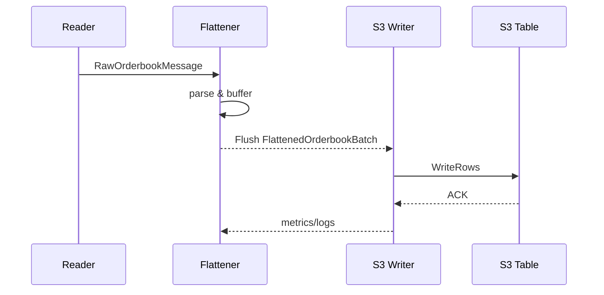

# CryptoFlow Codebase Overview

## Purpose
CryptoFlow is a Go service that streams high-frequency order book snapshots from cryptocurrency exchanges, normalizes the data, and persistently stores the results in Amazon S3. The project is structured as a pipeline of independent stages connected by Go channels. Each stage focuses on a single responsibility while exposing metrics and logs for observability.

## Repository Layout
- `main.go` – Application entrypoint that wires configuration, logging, and all pipeline components together.
- `config/` – Parsing and validation of runtime configuration written in YAML.
- `internal/` – Infrastructure utilities. Includes channel management and Iceberg metadata generation tools.
- `logger/` – Thin wrapper around logrus providing consistent structured logging.
- `models/` – Data structures for raw and processed order book messages.
- `reader/` – Exchange-specific code for fetching order book data (currently Binance).
- `processor/` – Transforms raw messages into flattened batches.
- `writer/` – Persists flattened batches to S3 using the S3Tables API.
- `cloudwatch/` – Pre-built dashboard describing how to visualize metrics in AWS CloudWatch.
- `scripts/` – Helper scripts, e.g., to create the CloudWatch dashboard.

The following sections describe each component in detail.

## main.go
`main.go` orchestrates the service:
1. Loads environment variables and configuration.
2. Configures the global logger.
3. Instantiates typed channels (`internal.Channels`).
4. Creates the reader, flattener, and optional S3 writer.
5. Starts components concurrently and listens for shutdown signals.
6. Ensures graceful termination by flushing buffers and waiting for goroutines to finish.

This file binds all other modules and is required to assemble the pipeline into a runnable service.

## config/
`config/config.go` defines the `Config` structure containing nested structs for every subsystem: channels, reader, processor, writer, storage, monitoring, and logging. `LoadConfig` reads YAML, applies environment overrides (notably AWS credentials), and validates required fields. Centralized configuration ensures reproducible deployments and allows fine‑grained tuning of concurrency, batching, rate limiting, and more.

## internal/
### channel.go
Defines `Channels`, a helper owning the `RawMessageChan` and `FlattenedChan`. It tracks statistics, periodically logs channel utilization, and offers increment helpers for sent/dropped messages. Having a single module manage channels decouples pipeline stages and provides back‑pressure awareness.

### metadata/
Utilities for writing [Apache Iceberg](https://iceberg.apache.org/) metadata. `iceberg.go` exposes `Generator`, which records `DataFile` manifests, aggregates `Snapshot` history, and optionally updates an S3Table catalog. This is used when downstream systems require Iceberg‑compatible tables for time‑travel queries.

## logger/
`logger/logger.go` wraps logrus with project‑specific behavior:
- Automatic JSON formatting with timestamps and caller information.
- Environment‑driven log level selection.
- Helper methods (`WithComponent`, `WithFields`, `LogMetric`, etc.) to keep logs and metrics consistent.

A shared logger avoids scattering logging concerns throughout the codebase and standardizes observability.

## models/
`models/orderbook.go` declares all core data types:
- `RawOrderbookMessage` – the raw snapshot from an exchange.
- `OrderbookEntry` and `OrderbookSnapshot` – structured representations of depth levels.
- `FlattenedOrderbookEntry` & `FlattenedOrderbookBatch` – normalized rows ready for storage.
- Binance‑specific structs to decode API responses.

Central models guarantee type safety between pipeline stages and document the schema written to storage.

## reader/
`reader/binance_reader.go` implements a polling reader for Binance futures snapshots. Key responsibilities:
- Configurable HTTP client with connection pooling, rate limiting, and retries.
- Periodic snapshot fetch per symbol.
- Validation of bid/ask consistency and spread percentage.
- Emission of `RawOrderbookMessage` into the raw channel with metrics on request count and errors.

The reader isolates exchange‑specific logic and shields the rest of the pipeline from network concerns.

## processor/
`processor/flattener.go` consumes raw messages and produces flattened batches:
- Parses JSON snapshots and expands each bid/ask into `FlattenedOrderbookEntry` rows.
- Buffers entries per `exchange/market/symbol` key, flushing when batch size or timeout is reached.
- Supports multiple worker goroutines and reports detailed metrics (processed messages, error rate, average entries per message, etc.).

Flattening converts heterogeneous exchange data into a uniform schema, enabling efficient storage and downstream analytics.

## writer/
`writer/s3_writer.go` persists batches into an Amazon S3Table using the WriteRows API:
- Initializes AWS SDK clients with credentials from configuration.
- Buffers entries grouped by partition and flushes at a configurable interval.
- Converts rows to the typed format required by S3Tables and handles API failures with metrics.

This stage provides durable storage and partitions data for long‑term analytics.

## cloudwatch/
Contains `dashboard.json` and README to create a CloudWatch dashboard that visualizes channel usage, processing rates, and error counts. These assets facilitate operational monitoring in production.

## scripts/
Currently includes a shell script to programmatically create the CloudWatch dashboard. Scripts automate repetitive setup tasks and keep operational knowledge in version control.

## Flowchart
```mermaid
flowchart LR
    A[Binance API] --> B[Reader\n(fetch snapshots)]
    B -->|RawOrderbookMessage| C[Flattener\n(flatten & batch)]
    C -->|FlattenedOrderbookBatch| D[S3 Writer]
    D -->|WriteRows| E[(S3 Table)]
```

## Sequence Diagram


## Why these components are needed
- **Reader** isolates exchange API interaction and ensures only validated data enters the system.
- **Channels** decouple stages, provide back‑pressure, and enable asynchronous processing.
- **Flattener** normalizes diverse exchange messages into a consistent schema and batches writes for efficiency.
- **Writer** handles durable persistence and partitioning in S3, allowing scalable analytics.
- **Configuration & Logger** centralize operational control and observability.
- **Metadata tools** support Iceberg table creation for advanced query capabilities.

Together, these modules form a resilient, observable pipeline from live exchange data to queryable storage.
