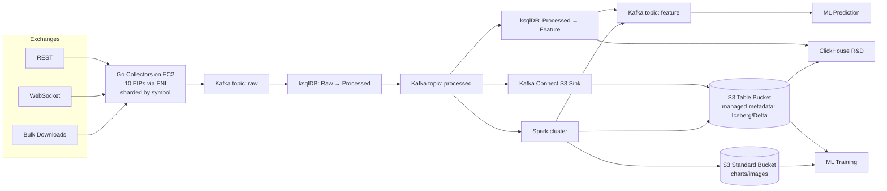
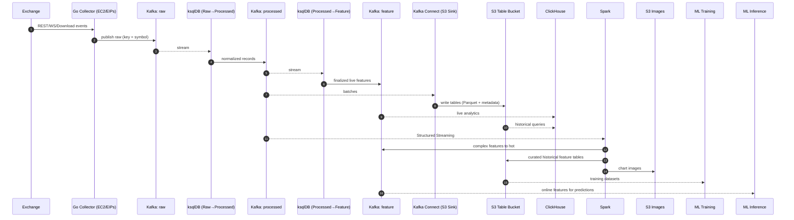

# High‑Resolution Crypto Market Data Platform — Architecture & Runbook

> **Purpose:** End‑to‑end description of the platform that ingests high‑resolution crypto market data (Binance, Bybit, OKX, …), serves **hot** (real‑time) and **cold** (historical) layers, and supports analytics, feature engineering, ML training, and online inference.

---

## Table of Contents
1. [Overview](#overview)
2. [System Diagrams](#system-diagrams)
    - [High‑Level Flowchart](#high-level-flowchart)
    - [End‑to‑End Sequence](#end-to-end-sequence)
3. [Deep Dive by Layer](#deep-dive-by-layer)
    - [Ingestion on EC2 (Go Collectors)](#ingestion-on-ec2-go-collectors)
    - [Kafka Topics & Serialization](#kafka-topics--serialization)
    - [Streaming Transforms with ksqlDB](#streaming-transforms-with-ksqldb)
    - [Cold Layer: S3 Table Bucket](#cold-layer-s3-table-bucket)
    - [ClickHouse (R&D + Fast OLAP)](#clickhouse-rd--fast-olap)
    - [Spark (Complex Features & Artifacts)](#spark-complex-features--artifacts)
    - [ML Training & Online Inference](#ml-training--online-inference)
4. [Data Model & Schemas](#data-model--schemas)
5. [Partitioning, Retention & Compaction](#partitioning-retention--compaction)
6. [Reliability, Reprocessing & Backfills](#reliability-reprocessing--backfills)
7. [Observability & SLOs](#observability--slos)
8. [Security, IAM & Network](#security-iam--network)
9. [Cost Guardrails](#cost-guardrails)
10. [Runbooks](#runbooks)
11. [Appendix: Examples & Snippets](#appendix-examples--snippets)

---

## Overview

**Hot layer** (Kafka topics + ClickHouse) provides near‑real‑time features and low‑latency analytics.  
**Cold layer** (S3 table bucket) is the durable, queryable historical store for analytics, backfills, and ML training.

**Key choices**
- **Go** collectors on **EC2** with **10 EIPs via ENI**, **sharded by symbol groups** to spread load and respect exchange limits.
- **Kafka** as the streaming backbone with three canonical topics: `raw` → `processed` → `feature`.
- **ksqlDB** to express live filters, joins, and window aggregations (Raw→Processed, Processed→Feature).
- **Kafka Connect** to persist `processed` into an **S3 table bucket** (managed metadata such as Iceberg/Delta‑style tables).
- **ClickHouse** for fast OLAP, R&D, and finalized historical feature computation.
- **Spark** to build **complex/expensive features** and **artifacts (charts)** from Kafka and S3.
- **ML** trains on S3 history; online inference consumes feature topics.

---

## System Diagrams

### High‑Level Flowchart



### End‑to‑End Sequence



---

## Deep Dive by Layer

### Ingestion on EC2 (Go Collectors)

- **Sharding:** Consistent hashing of `symbol` → one of **10 EIPs** bound to the host via **ENI**. Each EIP covers a **symbol group**, letting you parallelize across exchange rate‑limit buckets and isolate noisy symbols.
- **Inputs:** REST (poll), WebSocket (stream), Download links (bulk).
- **Concurrency:** Goroutines per symbol + bounded worker pools; channel‑based fan‑in.
- **Resilience:** Circuit breakers per exchange, exponential backoff, jittered retries, per‑IP rate limiters.
- **Clocking:** NTP sync; record both **exchange time** and **collector receive time**.
- **Serialization:** Prefer **Protobuf** (or Avro) with a Schema Registry; include `event_type`, `exchange`, `symbol`, `ts_ms`, and an **idempotency key** (see [Data Model](#data-model--schemas)).
- **Producer settings:** `acks=all`, idempotent producers, `compression.type=zstd`, tuned `linger.ms`/`batch.size` for throughput, key by `symbol`.

### Kafka Topics & Serialization

- **Topics (canonical):**
    - `raw.<domain>` — as‑collected payloads, minimal normalization.
    - `processed.<domain>` — validated, schema‑aligned, enriched fields.
    - `feature.<domain>` — finalized features for real‑time use.
- **Partitioning:** Key = `symbol` (ensures per‑symbol ordering). Start with 48–128 partitions for high fan‑out; scale as symbols grow.
- **Retention:** `raw` short (24–72h), `processed` few days (replay window), `feature` as business needs (often days/weeks).
- **Schema evolution:** Backward‑compatible only; deprecate fields behind feature flags; version headers on each record.
- **Exactly‑once:** Use idempotent producers + transactional writes for ksqlDB where available; sinks to S3 are typically **at‑least‑once**—use deterministic file naming + table snapshot atomicity to avoid duplicates.

### Streaming Transforms with ksqlDB

- **Raw → Processed:** Type casting, validation, enrichment (e.g., exchange → canonical symbol, decimals → scaled ints), drop corrupt rows, compute **ingest_latency_ms**.
- **Processed → Feature:** Sliding/tumbling windows, top‑N, rolling stats, micro‑joins with reference data (tick size, lot size), optional UDFs (e.g., volatility, microprice).
- **Design tips:** Use `PARTITION BY symbol` after normalization, ensure `TIMESTAMP='ts_ms'`, keep windows aligned to downstream S3 partitions (e.g., hour).

### Cold Layer: S3 Table Bucket

- **What:** Managed‑metadata tables (Iceberg/Delta‑style) stored as **Parquet** in S3.
- **Ingress:** Kafka Connect from `processed.*` topics (and Spark for curated features).
- **Partitioning:** `dt=YYYY‑MM‑DD/hour=HH/exchange=<ex>/market=<spot|future>/type=<snapshot|delta|...>/symbol=<SYM>`.
- **File sizing:** Target **128–512 MB** Parquet files with row groups 64–128 MB; compact small files hourly.
- **Compression:** `zstd` (level 3–5) for compute–storage balance.
- **Schema control:** Table‑level metadata enforces schema evolution, snapshot isolation, and time‑travel.

### ClickHouse (R&D + Fast OLAP)

- **Inputs:** (1) `Kafka` engine for live topics, (2) `S3` engine or external table for historical tables.
- **Pattern:** Ingest Kafka → `Materialized View` → `MergeTree` tables; TTL/partitions by day.
- **Use:** Rapid exploration of new features; compute **finalized historical features** and write to S3 tables (via external tools or CH S3 INSERT).
- **Why CH:** Sub‑second aggregations, vectorized execution, and direct S3/Kafka connectivity.

### Spark (Complex Features & Artifacts)

- **Streaming:** Structured Streaming from `processed.*`; compute heavy features (e.g., order‑book imbalance at 10 levels, microstructure signals), then write to **`feature.*`**.
- **Batch:** Read large historical partitions from S3, recompute features consistently with streaming logic, and **write curated feature tables** back to S3 (ensures offline/online parity).
- **Artifacts:** Produce charts (PNG/SVG) and save to **standard S3 bucket**; name by `exchange/symbol/dt/hour/...`.
- **Housekeeping:** Compaction, OPTIMIZE (Delta) or rewrite actions (Iceberg), metrics export, and job‑level retries/checkpointing.

### ML Training & Online Inference

- **Offline:** Training jobs read S3 feature tables (time‑bounded snapshots) with exact **as‑of** semantics.
- **Online:** Inference services subscribe to `feature.*` for real‑time features with strict per‑symbol ordering.
- **Feature parity:** Keep one source‑of‑truth definition (e.g., in code or a simple registry) used by both Spark (batch) and ksqlDB/Spark (streaming).

---

## Data Model & Schemas

**Common envelope (Protobuf/Avro):**
- `event_id` (string/bytes) — deterministic hash of `(exchange, symbol, event_type, exchange_ts, payload)` for idempotency.
- `exchange` (enum), `symbol` (string), `market` (enum: SPOT/FUTURE), `event_type` (enum).
- `exchange_ts_ms` (int64), `ingest_ts_ms` (int64).
- `payload` — type‑specific message.

**Examples (abridged):**

- **Order Book Snapshot (top 2000):**
    - `bids[]` / `asks[]`: arrays of `{px, qty}` (use scaled integers), `seq` (exchange sequence), `depth`.
- **Order Book Delta:**
    - `side` (BID/ASK), `px`, `qty`, `op` (UPSERT/DELETE), `seq`.
- **Funding Rate / Liquidations:** fields per exchange normalized to canonical units.

**Topic naming:**  
`raw.spot.orderbook.snapshot.binance`, `processed.future.orderbook.delta.okx`, `feature.spot.signals.bybit` (consistent facets).

---

## Partitioning, Retention & Compaction

- **Kafka partitions:** Key by `symbol`; start with 64 partitions for `raw`, 64 for `processed`, 32 for `feature` (tune by throughput).
- **Kafka retention:** `raw=48h`, `processed=5d`, `feature=7d` (example).
- **S3 partitioning:** `dt/hour/exchange/market/type/symbol`. Avoid too many small files per partition; enforce 100–500MB target.
- **Compaction:** Hourly Spark job to coalesce small Parquet files; Iceberg/Delta maintenance tasks to rewrite data files and optimize manifests.
- **Indexing:** For ClickHouse, partition by day, order by `(symbol, ts_ms)`; for S3 tables, rely on partition pruning + statistics.

---

## Reliability, Reprocessing & Backfills

- **At‑least‑once sinks:** S3 sinks may duplicate on retries; dedup by (event_id) downstream or rely on table snapshot isolation.
- **Reprocess from Kafka:** Rewind consumers to a timestamp (`processed`) to rebuild features; publish to a **side topic** then promote.
- **Backfills:** Spark batch over S3 partitions; consistent with streaming code; validate counts & checksums against source.
- **Failover:** If an EIP is throttled/banned, reassign its symbol shard; use health checks and autoscaling groups.
- **Time sync:** Use `exchange_ts_ms` for business time; `ingest_ts_ms` for pipeline latency tracking.

---

## Observability & SLOs

- **Metrics (Prometheus):** producer acks/retries, Kafka consumer lag, ksqlDB throughput/watermarks, Spark micro‑batch duration, S3 write errors, ClickHouse query latency, feature freshness.
- **Logging:** Structured JSON with request IDs and symbol; sampling for high‑volume paths.
- **Dashboards:** Kafka topic rates/lag, EIP rate‑limit hit rates, S3 file sizes per partition, feature delay histogram.
- **SLO examples:** 99p **ingest→feature** latency \< 2s; feature freshness \< 1s for 95p; missing‑data rate \< 0.1%.

---

## Security, IAM & Network

- **Network:** Collectors in private subnets with **EIPs via ENI**; MSK/ksqlDB private; VPC endpoints for S3.
- **IAM:** Least‑privilege roles; bucket policies scoped per path (`table/`, `images/`).
- **Encryption:** TLS in transit; S3/Kafka at rest (KMS).
- **Secrets:** AWS Secrets Manager for exchange API keys; short‑lived creds on instances.
- **Auditing:** CloudTrail + object‑level S3 logs on the table bucket.

---

## Cost Guardrails

- Prefer **zstd** compression and large Parquet files to reduce S3/scan costs.
- **ClickHouse** for interactive; push heavy/offline work to **Spark** on spot instances with dynamic allocation.
- Use **Intelligent‑Tiering** for old partitions; keep “hot months” in Standard; images in Standard‑IA where acceptable.
- Cap Kafka retention to replay windows; archive long‑term in S3 only.

---

## Runbooks

### Replay/Backfill a Broken Hour
1. Pause downstream consumers of `feature.*` for the affected symbols.
2. Rewind `processed.*` consumers in Spark to the start timestamp.
3. Recompute features; write to a **staging** S3 table and **side** feature topic.
4. Validate row counts & checksums; promote staging to production table and cut over feature topic.

### Promote an R&D Feature to Production
1. Prototype in ClickHouse reading `processed.*`.
2. Port logic to ksqlDB (streaming) + Spark (batch) from a **single spec**.
3. Run shadow for a week; compare distributions & drift.
4. Register schema & rollout with canary symbols.

---

## Appendix: Examples & Snippets

### ksqlDB (illustrative)

```sql
-- Raw → Processed
CREATE STREAM raw_orderbook WITH (KAFKA_TOPIC='raw.spot.orderbook.snapshot.binance', VALUE_FORMAT='PROTOBUF', TIMESTAMP='exchange_ts_ms');

CREATE STREAM processed_orderbook AS
SELECT
  exchange,
  symbol,
  exchange_ts_ms,
  ingest_ts_ms,
  normalize_book(payload) AS book,        -- UDF to scale prices/qty
  bytesize(payload) AS raw_bytes
FROM raw_orderbook
EMIT CHANGES;

-- Processed → Feature (rolling signal)
CREATE TABLE feature_microprice AS
SELECT
  symbol,
  TUMBLE_START(exchange_ts_ms, INTERVAL 1 SECOND) AS ts_window,
  microprice(book) AS microprice,
  imbalance(book, 10) AS ob_imbalance10
FROM processed_orderbook
GROUP BY symbol, TUMBLE(exchange_ts_ms, INTERVAL 1 SECOND)
EMIT CHANGES;
```

### Kafka Connect → S3 (illustrative config)

```json
{
  "name": "processed-to-s3-table",
  "config": {
    "connector.class": "io.confluent.connect.s3.S3SinkConnector",
    "tasks.max": "8",
    "topics.regex": "processed\\..*",
    "s3.bucket.name": "your-s3-table-bucket",
    "format.class": "io.confluent.connect.s3.format.parquet.ParquetFormat",
    "partitioner.class": "io.confluent.connect.storage.partitioner.TimeBasedPartitioner",
    "timestamp.extractor": "RecordField",
    "timestamp.field": "exchange_ts_ms",
    "path.format": "dt=YYYY-MM-dd/hour=HH/exchange=${record:header('exchange')}/market=${record:header('market')}/type=${record:header('event_type')}/symbol=${key}",
    "locale": "en",
    "timezone": "UTC",
    "rotate.interval.ms": "600000",
    "flush.size": "100000",
    "schema.compatibility": "BACKWARD"
  }
}
```

*(Note: property names vary slightly by connector distribution—treat this as a template.)*

### S3 Table Layout (example)

```
s3://your-s3-table-bucket/
  spot_orderbook_snapshot/
    dt=2025-08-19/hour=14/exchange=binance/market=spot/type=snapshot/symbol=BTCUSDT/
      part-0000-...snappy.parquet
```

### ClickHouse (Kafka → MergeTree)

```sql
CREATE TABLE kafka_processed (
  exchange String,
  symbol String,
  ts_ms DateTime64(3),
  payload String
) ENGINE = Kafka
SETTINGS kafka_broker_list='broker:9092',
         kafka_topic_list='processed.spot.orderbook.snapshot.binance',
         kafka_group_name='ch-processed-g1',
         kafka_format='Protobuf',
         kafka_num_consumers=4;

CREATE TABLE processed_mt (
  exchange LowCardinality(String),
  symbol LowCardinality(String),
  ts_ms DateTime64(3),
  ...
) ENGINE = MergeTree
PARTITION BY toDate(ts_ms)
ORDER BY (symbol, ts_ms);

CREATE MATERIALIZED VIEW mv_processed TO processed_mt AS
SELECT * FROM kafka_processed;
```

### Spark (Streaming skeleton)

```scala
val df = spark.readStream
  .format("kafka")
  .option("kafka.bootstrap.servers", brokers)
  .option("subscribe", "processed.spot.orderbook.snapshot.*")
  .load()

// parse, compute features, write to feature topic
df.writeStream
  .format("kafka")
  .option("topic", "feature.spot.signals")
  .option("checkpointLocation", "s3://checkpoints/feature_spot_signals")
  .start()
```

---

**Notes**
- Keep one canonical **feature spec** shared by streaming (ksqlDB/Spark) and batch (Spark) to guarantee offline/online parity.
- Use deterministic `event_id` for idempotency and downstream dedup.
- Guard against small files; compaction is essential for low‑cost queries.

---

**Owner:** Pinova Group  
**Last updated:** 2025/08/19

