```mermaid
graph LR

  T0["<b>T0 API JSON:</b><br/><pre>{
  &quot;lastUpdateId&quot;: 0,
&quot;bids&quot;: [[100, 5], [99, 3]],
&quot;asks&quot;: [[101, 2], [102, 4]]
}</pre>
<table border='1' cellspacing='0' cellpadding='4'> <tr><th colspan='5'>T0 Snapshot</th></tr> <tr><th>Side</th><th>Price</th><th>Size</th><th>vf</th><th>vt</th></tr> <tr><td align='center'>Bid</td><td align='center'>100</td><td align='center'>5</td><td align='center'>T0</td><td align='center'>NULL</td></tr> <tr><td align='center'>Bid</td><td align='center'>99</td><td align='center'>3</td><td align='center'>T0</td><td align='center'>NULL</td></tr> <tr><td align='center'>Ask</td><td align='center'>101</td><td align='center'>2</td><td align='center'>T0</td><td align='center'>NULL</td></tr> <tr><td align='center'>Ask</td><td align='center'>102</td><td align='center'>4</td><td align='center'>T0</td><td align='center'>NULL</td></tr> </table>"]

T1["<b>T1 API JSON:</b><br/><pre>{
&quot;event&quot;: &quot;delta&quot;,
&quot;bids&quot;: [[100, 7]],
&quot;asks&quot;: [[101, 0]]
}</pre>
<table border='1' cellspacing='0' cellpadding='4'> <tr><th colspan='5'>T1 Delta</th></tr> <tr><th>Side</th><th>Price</th><th>Size</th><th>vf</th><th>vt</th></tr> <tr><td align='center'>Bid</td><td align='center'>100</td><td align='center'>5</td><td align='center'>T0</td><td align='center'>T1</td></tr> <tr><td align='center'>Bid</td><td align='center'>100</td><td align='center'>7</td><td align='center'>T1</td><td align='center'>NULL</td></tr> <tr><td align='center'>Bid</td><td align='center'>99</td><td align='center'>3</td><td align='center'>T0</td><td align='center'>NULL</td></tr> <tr><td align='center'>Ask</td><td align='center'>101</td><td align='center'>2</td><td align='center'>T0</td><td align='center'>T1</td></tr> <tr><td align='center'>Ask</td><td align='center'>102</td><td align='center'>4</td><td align='center'>T0</td><td align='center'>NULL</td></tr> </table>"]

T2["<b>T2 API JSON:</b><br/><pre>{
&quot;event&quot;: &quot;delta&quot;,
&quot;bids&quot;: [[98, 6]],
&quot;asks&quot;: [[103, 2]]
}</pre>
<table border='1' cellspacing='0' cellpadding='4'> <tr><th colspan='5'>T2 Delta</th></tr> <tr><th>Side</th><th>Price</th><th>Size</th><th>vf</th><th>vt</th></tr> <tr><td align='center'>Bid</td><td align='center'>100</td><td align='center'>5</td><td align='center'>T0</td><td align='center'>T1</td></tr> <tr><td align='center'>Bid</td><td align='center'>100</td><td align='center'>7</td><td align='center'>T1</td><td align='center'>NULL</td></tr> <tr><td align='center'>Bid</td><td align='center'>99</td><td align='center'>3</td><td align='center'>T0</td><td align='center'>NULL</td></tr> <tr><td align='center'>Bid</td><td align='center'>98</td><td align='center'>6</td><td align='center'>T2</td><td align='center'>NULL</td></tr> <tr><td align='center'>Ask</td><td align='center'>101</td><td align='center'>2</td><td align='center'>T0</td><td align='center'>T1</td></tr> <tr><td align='center'>Ask</td><td align='center'>102</td><td align='center'>4</td><td align='center'>T0</td><td align='center'>NULL</td></tr> <tr><td align='center'>Ask</td><td align='center'>103</td><td align='center'>2</td><td align='center'>T2</td><td align='center'>NULL</td></tr> </table>"]

T3["<b>T3 API JSON:</b><br/><pre>{
&quot;event&quot;: &quot;delta&quot;,
&quot;bids&quot;: [[100, 6]]
}</pre>
<table border='1' cellspacing='0' cellpadding='4'> <tr><th colspan='5'>T3 Delta</th></tr> <tr><th>Side</th><th>Price</th><th>Size</th><th>vf</th><th>vt</th></tr> <tr><td align='center'>Bid</td><td align='center'>100</td><td align='center'>5</td><td align='center'>T0</td><td align='center'>T1</td></tr> <tr><td align='center'>Bid</td><td align='center'>100</td><td align='center'>7</td><td align='center'>T1</td><td align='center'>T3</td></tr> <tr><td align='center'>Bid</td><td align='center'>100</td><td align='center'>6</td><td align='center'>T3</td><td align='center'>NULL</td></tr> <tr><td align='center'>Bid</td><td align='center'>99</td><td align='center'>3</td><td align='center'>T0</td><td align='center'>NULL</td></tr> <tr><td align='center'>Bid</td><td align='center'>98</td><td align='center'>6</td><td align='center'>T2</td><td align='center'>NULL</td></tr> <tr><td align='center'>Ask</td><td align='center'>101</td><td align='center'>2</td><td align='center'>T0</td><td align='center'>T1</td></tr> <tr><td align='center'>Ask</td><td align='center'>102</td><td align='center'>4</td><td align='center'>T0</td><td align='center'>NULL</td></tr> <tr><td align='center'>Ask</td><td align='center'>103</td><td align='center'>2</td><td align='center'>T2</td><td align='center'>NULL</td></tr> </table>"]

T10["<b>T10 API JSON:</b><br/><pre>{
&quot;lastUpdateId&quot;: 10,
&quot;bids&quot;: [[100, 6], [97, 8]],
&quot;asks&quot;: [[102, 5], [104, 1]]
}</pre>
<table border='1' cellspacing='0' cellpadding='4'> <tr><th colspan='5'>T10 Snapshot</th></tr> <tr><th>Side</th><th>Price</th><th>Size</th><th>vf</th><th>vt</th></tr> <tr><td align='center'>Bid</td><td align='center'>100</td><td align='center'>5</td><td align='center'>T0</td><td align='center'>T1</td></tr> <tr><td align='center'>Bid</td><td align='center'>100</td><td align='center'>7</td><td align='center'>T1</td><td align='center'>T3</td></tr> <tr><td align='center'>Bid</td><td align='center'>100</td><td align='center'>6</td><td align='center'>T3</td><td align='center'>NULL</td></tr> <tr><td align='center'>Bid</td><td align='center'>99</td><td align='center'>3</td><td align='center'>T0</td><td align='center'>T10</td></tr> <tr><td align='center'>Bid</td><td align='center'>98</td><td align='center'>6</td><td align='center'>T2</td><td align='center'>T10</td></tr> <tr><td align='center'>Bid</td><td align='center'>97</td><td align='center'>8</td><td align='center'>T10</td><td align='center'>NULL</td></tr> <tr><td align='center'>Ask</td><td align='center'>101</td><td align='center'>2</td><td align='center'>T0</td><td align='center'>T1</td></tr> <tr><td align='center'>Ask</td><td align='center'>102</td><td align='center'>4</td><td align='center'>T0</td><td align='center'>T10</td></tr> <tr><td align='center'>Ask</td><td align='center'>102</td><td align='center'>5</td><td align='center'>T10</td><td align='center'>NULL</td></tr> <tr><td align='center'>Ask</td><td align='center'>103</td><td align='center'>2</td><td align='center'>T2</td><td align='center'>T10</td></tr> <tr><td align='center'>Ask</td><td align='center'>104</td><td align='center'>1</td><td align='center'>T10</td><td align='center'>NULL</td></tr></table>"]

T0 --> T1 --> T2 --> T3 --> T10
```

# Time‑Traveling Order Book in SQL (Binance Futures) — Snapshots + Deltas with SCD‑2
**Markdown‑Tables Edition (no Mermaid)**  
**Date:** 2025‑08‑19

> Purpose: Persist *all versions* of a futures order book with batch‑friendly SQL writes, efficient storage, and simple point‑in‑time (time‑travel) queries.  
> Scope: Works for Binance Futures (and other exchanges) and integrates cleanly with Go collectors + S3/Parquet.

---

## TL;DR

- Use a **versioned table** (SCD‑2) that stores one row per **price‑level version** with a validity window `[valid_from, valid_to)`.
- Apply **deltas** and **snapshots** with the same batch logic: **close** changed/missing rows (`valid_to = t`), then **insert** new versions (`valid_from = t`).
- Optionally log **raw events** first (append‑only), then **materialize** the SCD‑2 table asynchronously for reliability and reprocessing.
- Query any time `T` using:
  ```sql
  valid_from <= T AND (valid_to IS NULL OR valid_to > T)
  ```

---

## 1) Data Model A — Single Versioned Table (SCD‑2)

Each *price level* (exchange, symbol, side, price) exists as rows over time. When quantity changes (or the level disappears), you **close** the active row and **insert** a new one. No overwrites → full history.

### 1.1 Schema & Indexes (Postgres)

```sql
-- Core history table
CREATE TABLE order_book_history (
  id           BIGSERIAL PRIMARY KEY,
  exchange     VARCHAR(16)  NOT NULL,   -- e.g., 'binance_futures'
  symbol       VARCHAR(24)  NOT NULL,   -- e.g., 'BTCUSDT'
  side         VARCHAR(3)   NOT NULL,   -- 'bid' | 'ask'
  price        NUMERIC(38,10) NOT NULL,
  quantity     NUMERIC(38,10) NOT NULL,
  valid_from   TIMESTAMPTZ   NOT NULL,
  valid_to     TIMESTAMPTZ    NULL      -- NULL = still active
);

-- At most one active row per (exchange,symbol,side,price)
CREATE UNIQUE INDEX uq_active_level
  ON order_book_history(exchange, symbol, side, price)
  WHERE valid_to IS NULL;

-- Time-travel query performance
CREATE INDEX ix_time_window
  ON order_book_history(exchange, symbol, valid_from, valid_to);

-- Optional: range/interval partitioning by day/month on valid_from for pruning
```

> **MySQL note:** No partial index; emulate with a sentinel `valid_to` (e.g., `'9999-12-31'`) or generated columns + filtered unique constraints.

---

### 1.2 Worked Example (T0 → T1 → T2 → T3 → T10)

We use a tiny book for clarity.

- **T0 snapshot**
  ```text
  Bids: (100,5), (99,3)
  Asks: (101,2), (102,4)
  ```
- **T1 delta**: `(bid 100: 5→7)`, `(ask 101: 2→0)`
- **T2 delta**: `+ bid (98,6)`, `+ ask (103,2)`
- **T3 delta**: `(bid 100: 7→6)`
- **T10 snapshot**
  ```text
  Bids: (100,6), (97,8)
  Asks: (102,5), (104,1)
  ```

Below, each table shows **active rows** (i.e., `valid_to IS NULL`) immediately *after* that step.

#### Active rows **after T0 (snapshot)**

| Exchange         | Symbol  | Side | Price | Quantity | Valid From | Valid To |
|------------------|---------|------|------:|---------:|------------|----------|
| binance_futures  | BTCUSDT | bid  |   100 |        5 | T0         | NULL     |
| binance_futures  | BTCUSDT | bid  |    99 |        3 | T0         | NULL     |
| binance_futures  | BTCUSDT | ask  |   101 |        2 | T0         | NULL     |
| binance_futures  | BTCUSDT | ask  |   102 |        4 | T0         | NULL     |

#### Apply **T1** delta: `(bid 100: 5→7)`, `(ask 101: 2→0)`

| Exchange         | Symbol  | Side | Price | Quantity | Valid From | Valid To |
|------------------|---------|------|------:|---------:|------------|----------|
| binance_futures  | BTCUSDT | bid  |   100 |        7 | T1         | NULL     |
| binance_futures  | BTCUSDT | bid  |    99 |        3 | T0         | NULL     |
| binance_futures  | BTCUSDT | ask  |   102 |        4 | T0         | NULL     |

*Closed rows created by this step (for reference):*

| Exchange         | Symbol  | Side | Price | Quantity (old) | Valid From | Valid To |
|------------------|---------|------|------:|---------------:|------------|----------|
| binance_futures  | BTCUSDT | bid  |   100 |              5 | T0         | T1       |
| binance_futures  | BTCUSDT | ask  |   101 |              2 | T0         | T1       |

#### Apply **T2** delta: `+ bid (98,6)`, `+ ask (103,2)`

| Exchange         | Symbol  | Side | Price | Quantity | Valid From | Valid To |
|------------------|---------|------|------:|---------:|------------|----------|
| binance_futures  | BTCUSDT | bid  |   100 |        7 | T1         | NULL     |
| binance_futures  | BTCUSDT | bid  |    99 |        3 | T0         | NULL     |
| binance_futures  | BTCUSDT | bid  |    98 |        6 | T2         | NULL     |
| binance_futures  | BTCUSDT | ask  |   102 |        4 | T0         | NULL     |
| binance_futures  | BTCUSDT | ask  |   103 |        2 | T2         | NULL     |

#### Apply **T3** delta: `(bid 100: 7→6)`

| Exchange         | Symbol  | Side | Price | Quantity | Valid From | Valid To |
|------------------|---------|------|------:|---------:|------------|----------|
| binance_futures  | BTCUSDT | bid  |   100 |        6 | T3         | NULL     |
| binance_futures  | BTCUSDT | bid  |    99 |        3 | T0         | NULL     |
| binance_futures  | BTCUSDT | bid  |    98 |        6 | T2         | NULL     |
| binance_futures  | BTCUSDT | ask  |   102 |        4 | T0         | NULL     |
| binance_futures  | BTCUSDT | ask  |   103 |        2 | T2         | NULL     |

*Closed row created by this step (for reference):*

| Exchange         | Symbol  | Side | Price | Quantity (old) | Valid From | Valid To |
|------------------|---------|------|------:|---------------:|------------|----------|
| binance_futures  | BTCUSDT | bid  |   100 |              7 | T1         | T3       |

#### Apply **T10** snapshot**

Snapshot content:
```
Bids: (100,6), (97,8)
Asks: (102,5), (104,1)
```
Rules at `T10`:
- **Close** any active level **not in** the snapshot (`valid_to = T10`).
- **Close+Insert** if qty changed.
- **Insert** new levels.
- **Do nothing** for unchanged levels.

**Active rows after T10:**

| Exchange         | Symbol  | Side | Price | Quantity | Valid From | Valid To |
|------------------|---------|------|------:|---------:|------------|----------|
| binance_futures  | BTCUSDT | bid  |   100 |        6 | T3         | NULL     |
| binance_futures  | BTCUSDT | bid  |    97 |        8 | T10        | NULL     |
| binance_futures  | BTCUSDT | ask  |   102 |        5 | T10        | NULL     |
| binance_futures  | BTCUSDT | ask  |   104 |        1 | T10        | NULL     |

*Rows closed at T10 (due to snapshot reconciliation):*

| Exchange         | Symbol  | Side | Price | Quantity (old) | Valid From | Valid To |
|------------------|---------|------|------:|---------------:|------------|----------|
| binance_futures  | BTCUSDT | bid  |    99 |              3 | T0         | T10      |
| binance_futures  | BTCUSDT | bid  |    98 |              6 | T2         | T10      |
| binance_futures  | BTCUSDT | ask  |   103 |              2 | T2         | T10      |
| binance_futures  | BTCUSDT | ask  |   102 |              4 | T0         | T10      |

*Rows inserted at T10 (differences/new levels):*

| Exchange         | Symbol  | Side | Price | Quantity (new) | Valid From | Valid To |
|------------------|---------|------|------:|---------------:|------------|----------|
| binance_futures  | BTCUSDT | ask  |   102 |              5 | T10        | NULL     |
| binance_futures  | BTCUSDT | bid  |    97 |              8 | T10        | NULL     |
| binance_futures  | BTCUSDT | ask  |   104 |              1 | T10        | NULL     |

---

### 1.3 Validity Windows (time‑travel view)

This table lists **all versions** of each price level and their validity windows `[valid_from, valid_to)`.

| Side | Price | Quantity | Valid From | Valid To (exclusive) |
|------|------:|---------:|------------|----------------------|
| bid  |   100 |        5 | T0         | T1                   |
| bid  |   100 |        7 | T1         | T3                   |
| bid  |   100 |        6 | T3         | NULL                 |
| bid  |    99 |        3 | T0         | T10                  |
| bid  |    98 |        6 | T2         | T10                  |
| bid  |    97 |        8 | T10        | NULL                 |
| ask  |   101 |        2 | T0         | T1                   |
| ask  |   102 |        4 | T0         | T10                  |
| ask  |   102 |        5 | T10        | NULL                 |
| ask  |   103 |        2 | T2         | T10                  |
| ask  |   104 |        1 | T10        | NULL                 |

> **Time‑travel query**: select all rows where `valid_from <= :T` and `valid_to IS NULL OR valid_to > :T` to reconstruct the book at `:T`.

---

### 1.4 Batch Apply — Deltas (SQL pattern)

Use a **temporary staging table** to dedupe and apply many level changes atomically.

```sql
-- 1) Stage batch (dedupe by (exchange,symbol,side,price); new_qty=0 means delete)
CREATE TEMP TABLE batch_delta (
  exchange VARCHAR(16), symbol VARCHAR(24), side VARCHAR(3),
  price NUMERIC(38,10), new_qty NUMERIC(38,10), t_evt TIMESTAMPTZ
) ON COMMIT DROP;

-- 2) Close changed or deleted levels
UPDATE order_book_history h
SET valid_to = d.t_evt
FROM batch_delta d
WHERE h.exchange=d.exchange AND h.symbol=d.symbol
  AND h.side=d.side AND h.price=d.price
  AND h.valid_to IS NULL
  AND h.quantity IS DISTINCT FROM d.new_qty;

-- 3) Insert new/changed rows (skip deletions: new_qty=0)
INSERT INTO order_book_history (exchange,symbol,side,price,quantity,valid_from)
SELECT d.exchange, d.symbol, d.side, d.price, d.new_qty, d.t_evt
 FROM batch_delta d
 LEFT JOIN order_book_history h
   ON (h.exchange=d.exchange AND h.symbol=d.symbol
       AND h.side=d.side AND h.price=d.price AND h.valid_to IS NULL)
WHERE d.new_qty > 0 AND (h.id IS NULL OR h.quantity IS DISTINCT FROM d.new_qty);
```

---

### 1.5 Batch Apply — Snapshots (SQL pattern)

Treat a snapshot as a **large delta** at time `t_snap`: close missing levels, close+insert qty changes, insert new ones.

```sql
CREATE TEMP TABLE snapshot_levels (
  exchange VARCHAR(16), symbol VARCHAR(24), side VARCHAR(3),
  price NUMERIC(38,10), new_qty NUMERIC(38,10), t_snap TIMESTAMPTZ
) ON COMMIT DROP;

-- A) Close any active level NOT present in snapshot
UPDATE order_book_history h
SET valid_to = s.t_snap
FROM (SELECT DISTINCT exchange,symbol,side,t_snap FROM snapshot_levels) s
WHERE h.exchange=s.exchange AND h.symbol=s.symbol AND h.side=s.side
  AND h.valid_to IS NULL
  AND NOT EXISTS (
    SELECT 1 FROM snapshot_levels x
    WHERE x.exchange=h.exchange AND x.symbol=h.symbol
      AND x.side=h.side AND x.price=h.price
  );

-- B) Close qty-changed levels that remain present
UPDATE order_book_history h
SET valid_to = s.t_snap
FROM snapshot_levels s
WHERE h.exchange=s.exchange AND h.symbol=s.symbol
  AND h.side=s.side AND h.price=s.price
  AND h.valid_to IS NULL
  AND h.quantity IS DISTINCT FROM s.new_qty;

-- C) Insert new or qty-changed rows
INSERT INTO order_book_history (exchange,symbol,side,price,quantity,valid_from)
SELECT s.exchange,s.symbol,s.side,s.price,s.new_qty,s.t_snap
FROM snapshot_levels s
LEFT JOIN order_book_history h
  ON (h.exchange=s.exchange AND h.symbol=s.symbol
      AND h.side=s.side AND h.price=s.price AND h.valid_to IS NULL)
WHERE h.id IS NULL OR h.quantity IS DISTINCT FROM s.new_qty;
```

---

## 2) Data Model B — Raw Event Log + Materialized History

Write everything you ingest to an **append‑only log** first, then build/repair the SCD‑2 table in order. This adds reliability (reprocessing) and decouples ingestion from serving.

```sql
CREATE TABLE ob_events (
  event_id     BIGSERIAL PRIMARY KEY,
  exchange     VARCHAR(16)  NOT NULL,
  symbol       VARCHAR(24)  NOT NULL,
  event_type   VARCHAR(8)   NOT NULL, -- 'snapshot' | 'delta'
  event_time   TIMESTAMPTZ  NOT NULL, -- exchange event time
  seq_start    BIGINT,                -- optional exchange sequence bounds
  seq_end      BIGINT,
  payload      JSONB         NOT NULL, -- flattened per-level changes or raw
  received_at  TIMESTAMPTZ   NOT NULL DEFAULT now()
);
```

**High‑level pipeline (ASCII):**
```
WS/REST Collector -> Normalizer/Sequencer -> ob_events (append-only)
               ob_events -> (ordered batches) -> Applier/ETL -> order_book_history (SCD-2)
```

**Why it helps**
- **Ordering:** enforce `(seq_start..seq_end,event_time)`; buffer small windows to handle reorders.
- **Recovery:** if logic changes, **rebuild** `order_book_history` from `ob_events`.
- **Batching:** applier groups many events for efficient close/insert cycles.

---

## 3) How This Meets Your Goals

### High‑Efficiency Storage
- Store **only changes** (SCD‑2). No need to duplicate thousands of levels per snapshot.
- Columnar export (Parquet) compresses well; S3 costs drop with hourly compaction.
- **Partial unique index** on active rows prevents dupes; partitioning narrows scans.

### Time Traveling (Point‑in‑Time OB)
- A single predicate yields the exact book at `T`.
- Best bid/ask, top‑N depth, spreads, mid‑price are trivial SQL queries.
- Snapshots re‑sync history if deltas are missed; no holes.

### Ease of Use
- Ingestion logic for **deltas** and **snapshots** is *identical* (close & insert).
- With Model B, raw events provide a **clean audit trail** and simplify debugging & replay.
- Works across **multiple exchanges and data types** with `exchange`/`symbol` fields.

---

## 4) High‑Performance Notes & Ops Tips

- **Indexes**
    - `uq_active_level(exchange,symbol,side,price) WHERE valid_to IS NULL`
    - `ix_time_window(exchange,symbol,valid_from,valid_to)`
- **Partitioning** by day/month on `valid_from`. Prunes big historical scans.
- **Batch size**: 100–10,000 levels per write (DB dependent). Aim for <100 ms commit.
- **Idempotency**: coalesce within batches; ignore no‑ops.
- **Out‑of‑order**: use exchange sequence numbers; keep a small reorder buffer.
- **Zero quantity** = delete (close; no new row).
- **Throughput**: For very high rates, evaluate ClickHouse (MergeTree) or TimescaleDB hypertables.
- **Monitoring**: Prometheus — writer lag vs. exchange time, rows closed/inserted per batch, reorder count, retries, DB latency p99.

---

## 5) S3/Parquet Lakehouse Alignment (Iceberg/Delta)

- Mirror SCD‑2 to Parquet (Snappy) for analytics:
    - Columns: `exchange,symbol,side,price,quantity,valid_from,valid_to,is_current`
    - Partition: `dt = date_trunc('hour', valid_from)`, plus `exchange/symbol` folders.
- Use **hourly writers** per side/table (bids/asks) to S3; merge small files hourly.
- Compatible with **Iceberg/Delta Lake** metadata layers for ACID & schema evolution.

---

## 6) Go Integration Hints (Collectors & ETL)

- **Collectors**: WS + REST bootstrap, per‑exchange YAML config for endpoints and rate limits; use channels/fan‑out per symbol.
- **Normalizer**: unify to `(side, price, qty)`; coalesce within 10–50 ms windows for batch writes.
- **Writer**: staging temp tables + the SQL close/insert patterns above; expose Prometheus metrics.
- **Hourly S3**: buffer rows opened/closed within the hour and flush Parquet (Snappy).

---

## 7) Edge Cases & Gotchas

- **Snapshot at `T10` after unprocessed `T9.x` deltas**: apply `T10` first; ignore older deltas thereafter — snapshot is new ground truth.
- **Duplicate/late events**: dedupe per `(exchange,symbol,side,price,event_time,seq)`; applier must be idempotent.
- **Clock skew**: prefer *exchange event time* for `valid_from/valid_to`; track *received_at* separately.
- **MySQL partial‑index gap**: emulate with sentinel `valid_to` or triggers.

---

## Appendix — Handy Queries

**Full book at time `:T`:**
```sql
SELECT side, price, quantity
FROM order_book_history
WHERE exchange=:exchange AND symbol=:symbol
  AND valid_from <= :T
  AND (valid_to IS NULL OR valid_to > :T)
ORDER BY
  side,
  CASE WHEN side='bid' THEN price END DESC,
  CASE WHEN side='ask' THEN price END ASC;
```

**Best bid/ask at `:T`:**
```sql
WITH ob AS (
  SELECT side, price, quantity
  FROM order_book_history
  WHERE exchange=:exchange AND symbol=:symbol
    AND valid_from <= :T AND (valid_to IS NULL OR valid_to > :T)
)
SELECT
  (SELECT price FROM ob WHERE side='bid' ORDER BY price DESC LIMIT 1) AS best_bid,
  (SELECT price FROM ob WHERE side='ask' ORDER BY price ASC  LIMIT 1) AS best_ask;
```

**Top‑N depth (e.g., 10 levels each side) at `:T`:**
```sql
WITH ob AS (
  SELECT side, price, quantity
  FROM order_book_history
  WHERE exchange=:exchange AND symbol=:symbol
    AND valid_from <= :T AND (valid_to IS NULL OR valid_to > :T)
)
SELECT * FROM (
  SELECT * FROM ob WHERE side='bid' ORDER BY price DESC LIMIT 10
) AS bids
UNION ALL
SELECT * FROM (
  SELECT * FROM ob WHERE side='ask' ORDER BY price ASC LIMIT 10
) AS asks;
```

