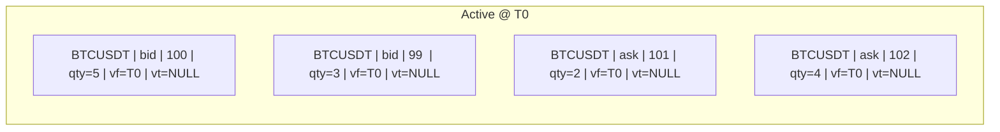
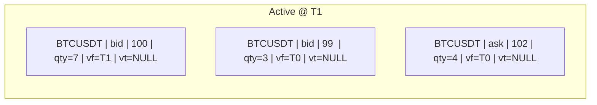
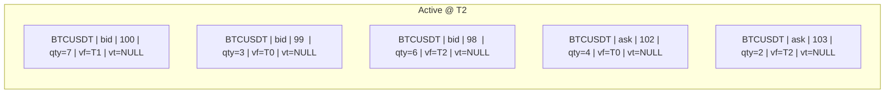
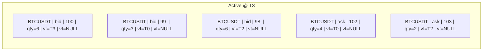
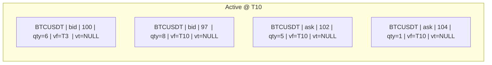
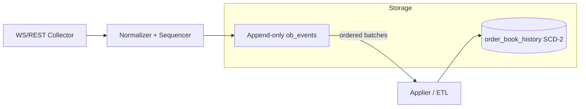

# Time‑Traveling Order Book in SQL (Binance Futures) — Snapshots + Deltas with SCD‑2

> **Purpose:** Persist *all versions* of a futures order book with batch‑friendly SQL writes, efficient storage, and simple point‑in‑time (time‑travel) queries.  
> **Audience:** Low‑latency collectors (Go), historical analytics (S3/Parquet), multi‑exchange systems (Binance/Bybit/OKX/Coinbase/Kraken/KuCoin).  
> **Date:** 2025‑08‑19

---

## TL;DR

- Use a **versioned table** (SCD‑2) that stores one row per **price‑level version** with a validity window `[valid_from, valid_to)`.  
- Apply **deltas** and **snapshots** with the *same* batch logic: **close** changed/missing rows (set `valid_to = t`), then **insert** new versions (`valid_from = t`).  
- Optionally log **raw events** first (append‑only) and **materialize** the SCD‑2 table asynchronously for reliability and reprocessing.  
- Query any time `T` with a single predicate:  
  ```sql
  valid_from <= T AND (valid_to IS NULL OR valid_to > T)
  ```

---

## Table of Contents

1. [Data Model A — Single Versioned Table (SCD‑2)](#data-model-a--single-versioned-table-scd2)  
   1.1. [Schema & Indexes](#schema--indexes)  
   1.2. [Worked Example (T0→T1→T2→T3→T10)](#worked-example-t0t1t2t3t10)  
   1.3. [Batch Apply — Deltas](#batch-apply--deltas)  
   1.4. [Batch Apply — Snapshots](#batch-apply--snapshots)  
   1.5. [Time‑Travel Queries](#time-travel-queries)  
2. [Data Model B — Raw Event Log + Materialized History](#data-model-b--raw-event-log--materialized-history)  
3. [How This Meets Your Goals](#how-this-meets-your-goals)  
4. [High‑Performance Notes & Ops Tips](#high-performance-notes--ops-tips)  
5. [S3/Parquet Lakehouse Alignment (Iceberg/Delta)](#s3parquet-lakehouse-alignment-icebergdelta)  
6. [Go Integration Hints (Collectors & ETL)](#go-integration-hints-collectors--etl)  
7. [Edge Cases & Gotchas](#edge-cases--gotchas)  
8. [Appendix — Full SQL Snippets](#appendix--full-sql-snippets)

---

## Data Model A — Single Versioned Table (SCD‑2)

**Idea:** Each *price level* (exchange, symbol, side, price) lives as rows over time. When quantity changes (or level disappears), you **close** the active row and **insert** a new one. No overwrites → full history.

### Schema & Indexes

> Postgres/TimescaleDB recommended for partial indexes and partitioning. Adjust types to your DB.

```sql
-- Core history table
CREATE TABLE order_book_history (
  id           BIGSERIAL PRIMARY KEY,
  exchange     VARCHAR(16)  NOT NULL,   -- e.g., 'binance_futures'
  symbol       VARCHAR(24)  NOT NULL,   -- e.g., 'BTCUSDT'
  side         VARCHAR(3)   NOT NULL,   -- 'bid' | 'ask'
  price        NUMERIC(38,10) NOT NULL,
  quantity     NUMERIC(38,10) NOT NULL,
  valid_from   TIMESTAMPTZ   NOT NULL,
  valid_to     TIMESTAMPTZ    NULL      -- NULL = still active
);

-- At most one active row per (exchange,symbol,side,price)
CREATE UNIQUE INDEX uq_active_level
  ON order_book_history(exchange, symbol, side, price)
  WHERE valid_to IS NULL;

-- Time-travel query performance
CREATE INDEX ix_time_window
  ON order_book_history(exchange, symbol, valid_from, valid_to);

-- Optional partitioning by day/month on valid_from for pruning
```

> **MySQL note:** no partial index — emulate with a composite unique key and a sentinel value for `valid_to` (e.g., `'9999-12-31'`) or use generated columns + filtered unique constraints if available.

---

### Worked Example (T0→T1→T2→T3→T10)

We keep a tiny book for clarity.

- **T0 snapshot**
  ```text
  Bids: (100,5), (99,3)
  Asks: (101,2), (102,4)
  ```
- **T1 delta**: `(bid 100: 5→7)`, `(ask 101: 2→0)`  
- **T2 delta**: `+ bid (98,6)`, `+ ask (103,2)`  
- **T3 delta**: `(bid 100: 7→6)`  
- **T10 snapshot**
  ```text
  Bids: (100,6), (97,8)
  Asks: (102,5), (104,1)
  ```

#### Active rows **after T0**



#### Apply **T1** delta: close+insert / delete



*(History also holds closed rows: `(bid,100,5)[T0,T1)`, `(ask,101,2)[T0,T1)`.)*

#### Apply **T2** delta: add two new levels



#### Apply **T3** delta: change bid@100



#### Apply **T10 snapshot** (full reconciliation)

Rules at `T10`:
- **Close** any active level **not in** the snapshot (`valid_to = T10`).  
- **Close + Insert** if qty changed.  
- **Insert** new levels.  
- **Do nothing** for unchanged levels.



#### Validity windows (time‑travel view)

```mermaid
gantt
title Validity of levels (units = T)
dateFormat  X
axisFormat  %L
section Bids
"100@5" :a1, 0, 1
"100@7" :a2, 1, 3
"100@6" :a3, 3, 100
"99@3"  :a4, 0, 10
"98@6"  :a5, 2, 10
"97@8"  :a6, 10, 100
section Asks
"101@2" :b1, 0, 1
"102@4" :b2, 0, 10
"102@5" :b3, 10, 100
"103@2" :b4, 2, 10
"104@1" :b5, 10, 100
```



> Now you can reconstruct the full book at any `T` by selecting rows valid at `T` (see queries below).

---

### Batch Apply — Deltas

> Use a **temporary staging table** to dedupe and apply many level changes atomically.

```sql
-- 1) Stage batch (dedupe by (exchange,symbol,side,price); new_qty=0 means delete)
CREATE TEMP TABLE batch_delta (
  exchange VARCHAR(16), symbol VARCHAR(24), side VARCHAR(3),
  price NUMERIC(38,10), new_qty NUMERIC(38,10), t_evt TIMESTAMPTZ
) ON COMMIT DROP;

-- 2) Close changed or deleted levels
UPDATE order_book_history h
SET valid_to = d.t_evt
FROM batch_delta d
WHERE h.exchange=d.exchange AND h.symbol=d.symbol
  AND h.side=d.side AND h.price=d.price
  AND h.valid_to IS NULL
  AND h.quantity IS DISTINCT FROM d.new_qty;

-- 3) Insert new/changed rows (skip deletions: new_qty=0)
INSERT INTO order_book_history (exchange,symbol,side,price,quantity,valid_from)
SELECT d.exchange, d.symbol, d.side, d.price, d.new_qty, d.t_evt
 FROM batch_delta d
 LEFT JOIN order_book_history h
   ON (h.exchange=d.exchange AND h.symbol=d.symbol
       AND h.side=d.side AND h.price=d.price AND h.valid_to IS NULL)
WHERE d.new_qty > 0 AND (h.id IS NULL OR h.quantity IS DISTINCT FROM d.new_qty);
```

**Idempotency:** ensure your batch has one net change per level (coalesce within the batch) and rely on `uq_active_level` to prevent duplicates.

---

### Batch Apply — Snapshots

> Treat a snapshot as a **large delta** at time `t_snap`: close missing levels, close+insert qty changes, insert new ones.

```sql
CREATE TEMP TABLE snapshot_levels (
  exchange VARCHAR(16), symbol VARCHAR(24), side VARCHAR(3),
  price NUMERIC(38,10), new_qty NUMERIC(38,10), t_snap TIMESTAMPTZ
) ON COMMIT DROP;

-- A) Close any active level NOT present in snapshot
UPDATE order_book_history h
SET valid_to = s.t_snap
FROM (SELECT DISTINCT exchange,symbol,side,t_snap FROM snapshot_levels) s
WHERE h.exchange=s.exchange AND h.symbol=s.symbol AND h.side=s.side
  AND h.valid_to IS NULL
  AND NOT EXISTS (
    SELECT 1 FROM snapshot_levels x
    WHERE x.exchange=h.exchange AND x.symbol=h.symbol
      AND x.side=h.side AND x.price=h.price
  );

-- B) Close qty-changed levels that remain present
UPDATE order_book_history h
SET valid_to = s.t_snap
FROM snapshot_levels s
WHERE h.exchange=s.exchange AND h.symbol=s.symbol
  AND h.side=s.side AND h.price=s.price
  AND h.valid_to IS NULL
  AND h.quantity IS DISTINCT FROM s.new_qty;

-- C) Insert new or qty-changed rows
INSERT INTO order_book_history (exchange,symbol,side,price,quantity,valid_from)
SELECT s.exchange,s.symbol,s.side,s.price,s.new_qty,s.t_snap
FROM snapshot_levels s
LEFT JOIN order_book_history h
  ON (h.exchange=s.exchange AND h.symbol=s.symbol
      AND h.side=s.side AND h.price=s.price AND h.valid_to IS NULL)
WHERE h.id IS NULL OR h.quantity IS DISTINCT FROM s.new_qty;
```

---

### Time‑Travel Queries

**Full book at time `:T`:**
```sql
SELECT side, price, quantity
FROM order_book_history
WHERE exchange='binance_futures' AND symbol='BTCUSDT'
  AND valid_from <= :T
  AND (valid_to IS NULL OR valid_to > :T)
ORDER BY
  side,
  CASE WHEN side='bid' THEN price END DESC,
  CASE WHEN side='ask' THEN price END ASC;
```

**Best bid/ask at `:T`:**
```sql
WITH ob AS (
  SELECT side, price, quantity
  FROM order_book_history
  WHERE exchange='binance_futures' AND symbol='BTCUSDT'
    AND valid_from <= :T AND (valid_to IS NULL OR valid_to > :T)
)
SELECT
  (SELECT price FROM ob WHERE side='bid' ORDER BY price DESC LIMIT 1) AS best_bid,
  (SELECT price FROM ob WHERE side='ask' ORDER BY price ASC  LIMIT 1) AS best_ask;
```

**Top‑N depth (e.g., 10 levels each side) at `:T`:**
```sql
WITH ob AS (
  SELECT side, price, quantity
  FROM order_book_history
  WHERE exchange='binance_futures' AND symbol='BTCUSDT'
    AND valid_from <= :T AND (valid_to IS NULL OR valid_to > :T)
)
SELECT * FROM (
  SELECT * FROM ob WHERE side='bid' ORDER BY price DESC LIMIT 10
) AS bids
UNION ALL
SELECT * FROM (
  SELECT * FROM ob WHERE side='ask' ORDER BY price ASC LIMIT 10
) AS asks;
```

---

## Data Model B — Raw Event Log + Materialized History

**Idea:** Write everything you ingest to an **append‑only log** first, then build/repair the SCD‑2 table in order. This adds reliability (reprocessing) and decouples ingestion from serving.

```sql
CREATE TABLE ob_events (
  event_id     BIGSERIAL PRIMARY KEY,
  exchange     VARCHAR(16)  NOT NULL,
  symbol       VARCHAR(24)  NOT NULL,
  event_type   VARCHAR(8)   NOT NULL, -- 'snapshot' | 'delta'
  event_time   TIMESTAMPTZ  NOT NULL, -- exchange event time
  seq_start    BIGINT,                -- optional exchange sequence bounds
  seq_end      BIGINT,
  payload      JSONB         NOT NULL, -- flattened per-level changes or raw
  received_at  TIMESTAMPTZ   NOT NULL DEFAULT now()
);
```

**Pipeline:**



**Why it helps**
- **Ordering:** enforce `(seq_start..seq_end,event_time)` ordering; buffer small windows to handle reorders.  
- **Recovery:** if logic changes, **rebuild** `order_book_history` from `ob_events`.  
- **Batching:** applier groups many events for efficient close/insert cycles.

---

## How This Meets Your Goals

### High‑Efficiency Storage
- Store **only changes** (SCD‑2). No need to duplicate thousands of levels per snapshot.
- Columnar export (Parquet) compresses well; S3 costs drop with hourly compaction.
- **Partial unique index** on active rows prevents dupes; partitioning narrows scans.

### Time Traveling (Point‑in‑Time OB)
- A single predicate yields the exact book at `T`.
- Best bid/ask, depth slices, spreads, mid‑price are trivial SQL queries.
- Snapshots re‑sync history if deltas are missed; no holes.

### Ease of Use
- The ingestion logic for **deltas** and **snapshots** is *identical* (close & insert).  
- With Model B, raw events provide a **clean audit trail** and simplify debugging & replay.  
- Works across **multiple exchanges and data types** by including `exchange` and `symbol` fields.

---

## High‑Performance Notes & Ops Tips

- **Indexes**
  - `uq_active_level(exchange,symbol,side,price) WHERE valid_to IS NULL`
  - `ix_time_window(exchange,symbol,valid_from,valid_to)`
- **Partitioning** by day/month on `valid_from`. Prunes big historical scans.
- **Batch size**: 100–10,000 levels per write (DB dependent). Aim for <100 ms commit for live systems.
- **Idempotency**: coalesce within batches; ignore no‑ops.
- **Out‑of‑order**: use exchange sequence numbers; keep a small reorder buffer.
- **Zero quantity** = delete (close; no new row).  
- **Throughput**: For very high rates, evaluate ClickHouse (MergeTree) or TimescaleDB hypertables.
- **Monitoring**: Prometheus — writer lag vs. exchange time, rows closed/inserted per batch, reorder count, retry rate, DB latency p99.

---

## S3/Parquet Lakehouse Alignment (Iceberg/Delta)

- Mirror SCD‑2 to Parquet (Snappy) for analytics:
  - Columns: `exchange,symbol,side,price,quantity,valid_from,valid_to,is_current`
  - Partition: `dt = date_trunc('hour', valid_from)`, plus `exchange/symbol` folders.
- Use **hourly writers** per side/table (bids/asks) to S3; merge small files hourly.  
- Compatible with **Iceberg/Delta Lake** metadata layers for ACID & schema evolution.

---

## Go Integration Hints (Collectors & ETL)

- **Collectors**: WS+REST bootstrap, per‑exchange YAML config for endpoints and rate limits; use channels/fan‑out per symbol.
- **Normalizer**: unify into `(side, price, qty)`; coalesce within 10–50 ms windows for batch writes.
- **Writer**: staging temp tables + single‑txn close/insert patterns above; expose Prometheus metrics.
- **Hourly S3**: buffer rows opened/closed within the hour and flush Parquet (Snappy).

---

## Edge Cases & Gotchas

- **Snapshot at `T10` after some unprocessed `T9.x` deltas**: apply `T10` first; ignore older deltas thereafter (or quarantine) — snapshot is new ground truth.
- **Duplicate/late events**: dedupe per `(exchange,symbol,side,price, event_time, seq)`; applier must be idempotent.
- **Clock skew**: prefer *exchange event time* for `valid_from/valid_to`; log *received_at* separately.
- **MySQL partial index gap**: emulate with sentinel `valid_to` or triggers.

---

## Appendix — Full SQL Snippets

> **Create tables & indexes**

```sql
-- History (SCD-2)
CREATE TABLE order_book_history (
  id           BIGSERIAL PRIMARY KEY,
  exchange     VARCHAR(16)  NOT NULL,
  symbol       VARCHAR(24)  NOT NULL,
  side         VARCHAR(3)   NOT NULL,
  price        NUMERIC(38,10) NOT NULL,
  quantity     NUMERIC(38,10) NOT NULL,
  valid_from   TIMESTAMPTZ   NOT NULL,
  valid_to     TIMESTAMPTZ    NULL
);

CREATE UNIQUE INDEX uq_active_level
  ON order_book_history(exchange, symbol, side, price)
  WHERE valid_to IS NULL;

CREATE INDEX ix_time_window
  ON order_book_history(exchange, symbol, valid_from, valid_to);

-- Raw event log (optional)
CREATE TABLE ob_events (
  event_id     BIGSERIAL PRIMARY KEY,
  exchange     VARCHAR(16)  NOT NULL,
  symbol       VARCHAR(24)  NOT NULL,
  event_type   VARCHAR(8)   NOT NULL, -- 'snapshot' | 'delta'
  event_time   TIMESTAMPTZ  NOT NULL,
  seq_start    BIGINT,
  seq_end      BIGINT,
  payload      JSONB         NOT NULL,
  received_at  TIMESTAMPTZ   NOT NULL DEFAULT now()
);
```

> **Time‑travel book at `:T`**

```sql
SELECT side, price, quantity
FROM order_book_history
WHERE exchange=:exchange AND symbol=:symbol
  AND valid_from <= :T
  AND (valid_to IS NULL OR valid_to > :T);
```

> **Best bid/ask at `:T`**

```sql
WITH ob AS (
  SELECT side, price, quantity
  FROM order_book_history
  WHERE exchange=:exchange AND symbol=:symbol
    AND valid_from <= :T AND (valid_to IS NULL OR valid_to > :T)
)
SELECT
  (SELECT price FROM ob WHERE side='bid' ORDER BY price DESC LIMIT 1) AS best_bid,
  (SELECT price FROM ob WHERE side='ask' ORDER BY price ASC  LIMIT 1) AS best_ask;
```

> **Batch apply patterns** — see the *Batch Apply* sections above.

---

**End.**
