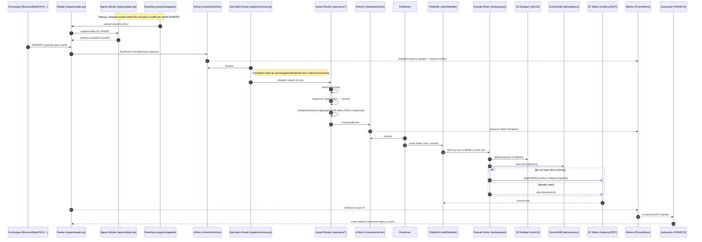

# CryptoFlow Monorepo Layout (Shared Libs, Sharding, Egress-IP Pinning, S3 Tables)

This document is the **authoritative map** of the repository. It explains every folder and the key Go files, what each does, and *how* it does it. The design centers on:
- All **transformations** (filtering, flattening, dedupe, sequencing, aggregations, OB state) inside **normalization**.
- **Bounded channels** with per-market buffer sizes and first-class **metrics**.
- **Symbol-based sharding** that preserves ordering and enables horizontal scale.
- **Shard-scoped egress** so each shard uses a specific ENI/EIP on EC2.
- **Amazon S3 Tables** (managed Iceberg) with atomic appends and idempotent commits.

---

## Repository Tree (high-level)

```text
repo/
├─ go.mod / go.sum
├─ Makefile
├─ .golangci.yml
├─ .github/workflows/
│   ├─ ci.yml
│   ├─ release.yml
│   └─ terraform.yml
│
├─ cmd/                             # Thin binaries → containers (config + wiring only)
│  ├─ collector-ticks/
│  ├─ collector-spot-ob/
│  ├─ collector-spot-delta/
│  ├─ collector-futures-ob/
│  ├─ collector-futures-delta/
│  ├─ collector-liquidations/
│  ├─ collector-funding/
│  ├─ committer/                    # optional sidecar: S3 Tables (Iceberg REST) commits
│  └─ replayer/                     # high-speed fixture replay for tests/bench
│
├─ internal/                        # Shared libs (no main)
│  ├─ app/                          # DI, flags, env, errgroup, shutdown
│  ├─ config/                       # YAML → structs; per-market overrides; validation
│  ├─ logger/                       # zap; trace IDs; sampling
│  ├─ metrics/                      # Prometheus registry & helpers
│  ├─ tracing/                      # (optional) OpenTelemetry
│  ├─ health/                       # /live /ready
│  ├─ errors/                       # typed errors & wrapping
│  ├─ channels/                     # bounded channels + metrics
│  ├─ sharding/                     # symbol→shard; replica assignment
│  ├─ egress/                       # ENI/EIP pinning per shard; dialers
│  ├─ exchanges/                    # exchange adapters (pure I/O)
│  ├─ ingest/                       # readers + decoders → chRaw
│  ├─ model/                        # RawEvent + Canonical (post-normalize) + enums
│  ├─ normalize/                    # ★ all transformations
│  ├─ partitioner/                  # CanonicalEvent → (table, hour, symbol)
│  ├─ sink/                         # filebuffer → parquet → s3 → s3tables
│  ├─ idempotency/                  # DDB-backed seen-or-put
│  ├─ backpressure/                 # drop/spill/wait policies; alerts
│  ├─ retry/                        # backoff, jitter, circuit breakers
│  ├─ security/                     # SSM/Secrets, KMS helpers
│  └─ version/                      # build info, git SHA, semver
│
├─ pkg/                             # optional public helpers
│
├─ configs/                         # versioned runtime configs
│  ├─ dev/ …
│  └─ prod/ …
│
├─ build/
│  ├─ docker/                       # distroless/scratch Dockerfiles
│  ├─ goreleaser/
│  └─ scripts/
│
├─ deploy/
│  ├─ ecs/                          # task defs, autoscaling
│  ├─ k8s/                          # Helm/kustomize + HPA
│  ├─ systemd/
│  └─ compose/
│
├─ infra/                           # Terraform (creation, deployment, maintenance)
│  ├─ modules/
│  │   ├─ s3tables_bucket/
│  │   ├─ s3tables_tables/
│  │   ├─ iam_writer/
│  │   ├─ ddb_idem/
│  │   ├─ ecr/
│  │   ├─ ec2_multi_eni/
│  │   ├─ eip_attach/
│  │   ├─ observability/
│  │   ├─ athena/
│  │   └─ ssm_params/
│  └─ envs/{dev,prod}/
│
├─ test/
│  ├─ fixtures/
│  ├─ golden/
│  ├─ integration/
│  ├─ bench/
│  └─ load/
│
├─ tools/                           # schema codegen, mocks, etc.
└─ docs/
   ├─ adrs/
   ├─ data-contracts/
   ├─ operations/
   ├─ security.md
   └─ contributing.md
```

---

## `cmd/` — Thin Binaries (Containers)

Each subfolder is a `main` package that wires shared libs based on config and flags. They **do not** contain business logic.

- **`collector-*/main.go`**
  - Reads config/flags (exchange, stream, shard ring size `total_shards`, `replica_index`, `replica_count`).
  - Builds **per-market channels** using `internal/channels` with caps from config.
  - Starts **channel watcher** to export depth/occupancy/latency metrics.
  - Computes owned shard IDs via `sharding.Rangeplan`.
  - For each owned shard:
    - Chooses a **local private IP** via `egress.IPForShard()` (ENI/EIP pinning).
    - Starts the shard pipeline: **reader → normalization → partitioner → sink**.
- **`committer/main.go` (optional)**
  - Consumes manifest records and performs **Iceberg REST AppendFiles** to S3 Tables (atomic commit).
- **`replayer/main.go`**
  - Replays `test/fixtures` at high speed through the pipeline for golden tests and profiling.

---

## `internal/` — Shared Libraries (Platform Layer)

### `app/`
- Bootstrap glue: lifecycle (`context.Context` cancel on signals), `errgroup`, HTTP server for health, metrics endpoint.
- Central DI: exposes constructors for readers, pipelines, sinks.

### `config/`
- Strongly-typed YAML → Go structs.
- **Per-market overrides** for channel caps:
  ```yaml
  channels:
    defaults: { raw_cap: 8192, norm_cap: 8192, buffer_inbox_cap: 2048 }
    overrides:
      binance:
        spot_delta: { raw_cap: 32768, norm_cap: 32768, buffer_inbox_cap: 8192 }
  ```
- Validates ranges (e.g., `total_shards` immutable), symbols, flush sizes, ENI/EIP lists.
- Env/flag overrides for containerized deployments.

### `logger/`
- `zap.Logger` with sane JSON fields: `exchange`, `stream`, `shard`, `symbol`, `trace_id`.
- Sampling to avoid log storms; request-scoped loggers.

### `metrics/`
- Prometheus registry and helpers; standard labels `{exchange, stream, shard}`.
- Metrics you get out-of-the-box:
  - `channel_depth`, `channel_occupancy_ratio`, `channel_enqueue_delay_seconds`.
  - `reader_messages_total`, `seq_gaps_total`, `drops_total`.
  - `flush_size_bytes`, `flush_duration_seconds`, `s3_upload_retries_total`.
  - `s3tables_commit_latency_seconds`, `idempotency_dupe_total`.

### `health/`
- `/live` = process up.
- `/ready` = at least one exchange connected, writers healthy, last commit < N seconds.

### `channels/`
- **`bchan.go`**: typed, bounded channels that export depth/occupancy and enqueue-delay histograms on every send/recv. Non-blocking by default; consults `backpressure` policy when full (drop/spill/wait).
- **`watcher.go`**: background sampler (e.g., every 250 ms) that updates gauges and high-water marks; drives autoscaling alerts.

**How it works:** wraps `chan T` with small envelopes capturing enqueue time; uses `len(ch)` to sample depth; exposes an `.Any()` adapter for watcher arrays.

### `sharding/`
- **`assign.go`**: `ShardID(exchange, symbol, totalShards)` using FNV-1a/xxhash → stable mapping.
- **`rangeplan.go`**: ownership predicate `Owned(shardID, replicaIndex, replicaCount)` → shard belongs to replica when `shardID % replicaCount == replicaIndex`.
- Ensures **per-symbol order** and **no churn** when scaling replicas.

### `egress/`
- **`ipmap.go`**: maps `shardID → local private IP` using a pool (round-robin) with optional explicit overrides and rotation on rate-limit.
- **`dialer.go`**: builds **HTTP** and **WebSocket** dialers bound to `LocalAddr=privateIP` so SNAT uses the EIP attached to that IP.
- **`limiter.go`**: caps concurrent conns per IP; rotates to next IP on 429s for a cool-down; exposes per-IP metrics.
- **`imds.go`** (optional): discovers ENIs and secondary IPs from EC2 metadata or AWS SDK at boot.

**How it works:** user-space binding to a private IP on an attached ENI directs outbound TCP through the matching EIP; no root netns tricks required.

### `exchanges/`
- Per-exchange adapters (Binance/Bybit/OKX/Coinbase/Kraken) with **no business logic**—just I/O:
  - WS/REST connect with **per-shard dialer** from `egress`.
  - Subscription multiplexing, heartbeats, backoff, and message framing.
  - Emits `model.RawEvent` to `ingest`.

### `ingest/`
- **`reader.go`**: goroutine per `(exchange, streamKind)` (and per shard) that **never blocks** on downstream; on backpressure, follows policy (drop/spill/warn).
- **`decoder/`**: translates payloads into fast `RawEvent` structs; stamps `exchange_ts` and `ingest_ts`; extracts `seq` if available.

### `model/`
- **`raw.go`**: `RawEvent{Exchange, Symbol, Kind, Payload, ExchangeTS, IngestTS, Seq}`.
- **`canonical/*.go`**: one struct per **output table** (tick, spot_ob, spot_delta, futures_ob, futures_delta, liquidation, funding). Already flattened and enriched; matches Parquet/Iceberg schema.
- **`enums.go`**: `StreamKind`, `Side`, `Action`, etc.
- **`schema_version.go`**: semantic versions of each output table; used by `normalize/schema`.

### `normalize/`
- **`pipeline/`**
  - **`builder.go`**: composes operator chains from config for each `StreamKind`.
  - **`runner.go`**: **keyed worker pool**. Router does consistent-hash on `(exchange|symbol)` → per-key ordered processing; feeds `chNorm`.
- **`operators/`**
  - **`filter.go`**: min notional/qty, price bands, allow/deny lists.
  - **`map.go`**: symbol normalization; derived fields (e.g., notional, microprice).
  - **`flatten.go`**: OB arrays → level rows; payload → canonical columns.
  - **`sequencer.go`**: strict ordering by `seq`; gap detection; emits **reseed** signals to readers; pauses that key until resynced.
  - **`dedupe.go`**: content-hash or seq-window dedupe.
  - **`watermark.go`**: event-time watermarks per key; late-data policy.
  - **`aggregate.go`**: tumbling/sliding windows (OHLC, VWAP, volume, counts).
  - **`ob_state.go`**: in-memory order book; applies deltas; emits **100 ms** snapshots and **1 s** checkpoints; depth cap (e.g., 2000).
  - **`metrics.go`**: per-operator latency histograms and counters.
- **`windows/`**: generic window engine (merge/retract within lateness).
- **`schema/`**: maps canonical structs to Parquet/Iceberg schemas; handles evolving versions.
- **`registry/`**: compile-time operator/pipeline registration (safe alternative to Go `plugin`).

**How it works:** all business logic lives here so writers stay trivial and deterministic.

### `partitioner/`
- Pure function: `CanonicalEvent → (table, partition hour, symbol shard)`; minimal allocations; prepared formatters for hot paths.

### `sink/`
- **`filebuffer/`**: per `(table, hour, symbol)` buffers that flush by **size (128 MB)** or **time (5 s)**; exposes depth metrics.
- **`parquet/`**: Snappy compression, dictionary encoding, row-group stats (min/max/nulls); returns a `DataFile` descriptor.
- **`s3/`**: multipart upload; deterministic key format and object tags; retries with jitter.
- **`s3tables/`**: **Iceberg REST** `AppendFiles` against **Amazon S3 Tables**; atomic commit with snapshot ID; publishes commit latency. Can also emit manifests for the `cmd/committer` sidecar.

### `idempotency/`
- DynamoDB table keyed by `file_key` (path/hash). `SeenOrPut(fileKey)` returns true if already committed; ensures **exactly-once** at the table level even with at-least-once upstream.

### `backpressure/`
- Pluggable policies when a channel is full: `wait`, `drop-oldest`, `sample`, or `spill-to-disk`. Emits alerts when any queue occupancy > 80% for sustained periods.

### `retry/`
- Exponential backoff with jitter; circuit breakers for flaky deps (WS, S3, REST).

### `security/`
- Pulls secrets from SSM/Secrets Manager; helpers for KMS-encrypted data.

### `version/`
- Exposes `version.Build`, `version.GitSHA`, `version.Time` via logs and `/ready`.

---

## `configs/` — Runtime Settings

- **Per-market channel sizes**, pipelines, sharding, and egress IP pools:
  ```yaml
  exchange: binance
  stream: spot_delta
  symbols: [BTCUSDT, ETHUSDT, SOLUSDT, BNBUSDT, XRPUSDT]

  channels:
    defaults: { raw_cap: 8192, norm_cap: 8192, buffer_inbox_cap: 2048 }
    overrides:
      binance:
        spot_delta: { raw_cap: 32768, norm_cap: 32768, buffer_inbox_cap: 8192 }

  sharding:
    total_shards: 1024
    replica_index: 0
    replica_count: 4
    egress_pool: [10.0.1.101, 10.0.1.102, 10.0.2.101, 10.0.2.102]
    per_shard_ip_override: { "413": 10.0.1.102 }

  parquet: { target_mb: 128, flush_interval_ms: 5000 }

  s3tables:
    bucket: cryptoflow-tables-prod
    namespace: cryptoflow
    table: spot_orderbook_delta
    rest_endpoint: https://<region-endpoint>/s3tables/iceberg
  ```

---

## `deploy/` — Runtime Manifests

- **ECS/K8s/systemd** templates. Autoscaling driven by Prometheus metrics (queue occupancy) and CPU.
- HPA or ECS Target-Tracking scales `replica_count`; sharding logic keeps symbol→shard stable.

---

## `infra/` — Terraform

- **`s3tables_bucket`**: Amazon S3 **Table Bucket** and policy.
- **`s3tables_tables`**: Namespaces + tables (ticks, spot_ob, spot_delta, futures_*, liquidation, funding).
- **`iam_writer`**: Least-privilege roles for collectors/committers (S3 put, S3Tables, DDB, logs).
- **`ddb_idem`**: DynamoDB table for idempotency ledger.
- **`ec2_multi_eni`** + **`eip_attach`**: multiple ENIs, secondary private IPs, and EIP associations for **egress sharding**.
- **`observability`**: CloudWatch alarms/dashboards; (optional) Prometheus infra.
- **`ecr`**, **`athena`**, **`ssm_params`** as needed.

---

## `test/` — Quality Gates

- **fixtures/**: captured payloads per exchange/stream.
- **golden/**: expected canonical outputs for deterministic validation.
- **integration/**: end-to-end runs (localstack optional) → Parquet → S3 Tables.
- **bench/**: micro-benchmarks for operators; throughput regressions.
- **load/**: soak tests; leak detection; CPU/mem profiles.

---

## Engineering Conventions

- **Bounded channels** everywhere; readers never block network loops.
- **Per-symbol ordering** via keyed workers; **event-time** windowing with watermarks.
- **Idempotent writes**: deterministic file keys + DDB ledger + atomic Iceberg append.
- **Healthy files**: target ~128 MB Parquet; rich column stats for query pruning.
- **Observability-first**: queues, latencies, errors, commits, per-IP 429s; `/live` & `/ready`.
- **Security**: KMS, SSM/Secrets, least-priv IAM; no secrets in git.
- **CI**: lint, unit, golden, bench, integration, image, Terraform plan; manual approval for apply.

---

## End-to-End Sequence Diagram



---

## Notes on Egress-IP Pinning

- Each shard’s outbound sockets are bound to a specific **private IP** on an attached **ENI**; NAT selects the **EIP** associated with that IP, achieving **per-shard public IPs**.
- Rotation policy moves a shard to a different IP when 429s exceed a threshold (with cool-down), staying within exchange TOS.
- Tune OS networking for high conn counts per IP (`ulimit -n`, `ip_local_port_range`, TCP keepalive).

---

## Closing

This layout keeps **one codebase** with **shared, battle-tested libraries**, while runtime **containers** scale independently by stream and exchange. It preserves strict per-symbol ordering, gives you deep visibility into every channel, and ensures durable, idempotent delivery into **Amazon S3 Tables**.
