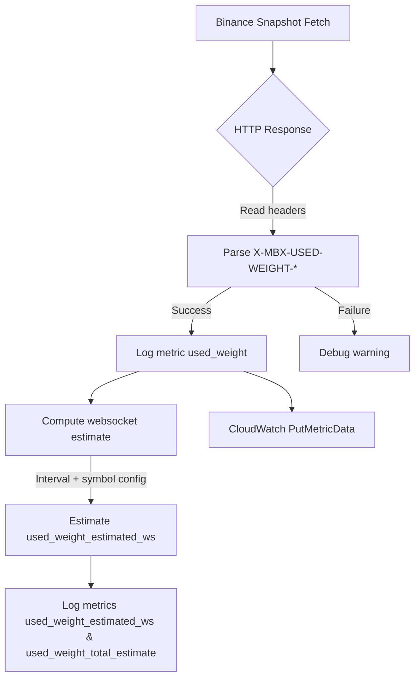

# Binance Futures Used Weight Metrics

This document explains how CryptoFlow estimates Binance futures request usage across REST snapshot polling and websocket diff-depth streaming, and how the measurements are published to CloudWatch.

## Metric Overview

- `used_weight` – raw minute weight extracted from the `X-MBX-USED-WEIGHT-*` response headers returned by Binance REST snapshot requests.
- `used_weight_estimated_ws` – heuristic load attributed to websocket diff-depth activity, derived from configuration (symbol count and interval).
- `used_weight_total_estimate` – sum of the REST weight and websocket estimate, used as an early warning signal for aggregate throttling pressure.

Every metric includes the following CloudWatch dimensions:

- `component`: `binance_reader`
- `exchange`: `binance`
- `market`: `future-orderbook-snapshot`
- `symbol`: the instrument associated with the snapshot fetch
- `window`: the Binance reporting window indicated by the header (`1m` or `1s`)
- `ip` (optional): present when the reader is bound to a specific local IP

## Estimation Model

Websocket usage is approximated by converting the configured diff-depth interval to messages per second, multiplied by the number of subscribed symbols. The per-minute rate is then divided evenly across symbols to align with per-snapshot reporting.

Formula:

```
updates_per_symbol_per_second = 1000 / interval_ms
updates_per_second = updates_per_symbol_per_second * symbols
used_weight_estimated_ws = updates_per_second * 60 / symbols
```

This assumes every diff-depth message contributes a unit of load comparable to REST weight. The heuristic can be tuned if Binance publishes tighter guidance.

## Metric Flow



## Alerts & Dashboards

- Track `used_weight_total_estimate` against Binance's documented weight ceilings (e.g., 1200 per minute per IP).
- Flag sustained increases in `used_weight_estimated_ws` as indicators of expanding symbol coverage or tighter streaming intervals.
- Combine with reconnect counters from the delta reader to spot websocket throttling before an IP ban occurs.
