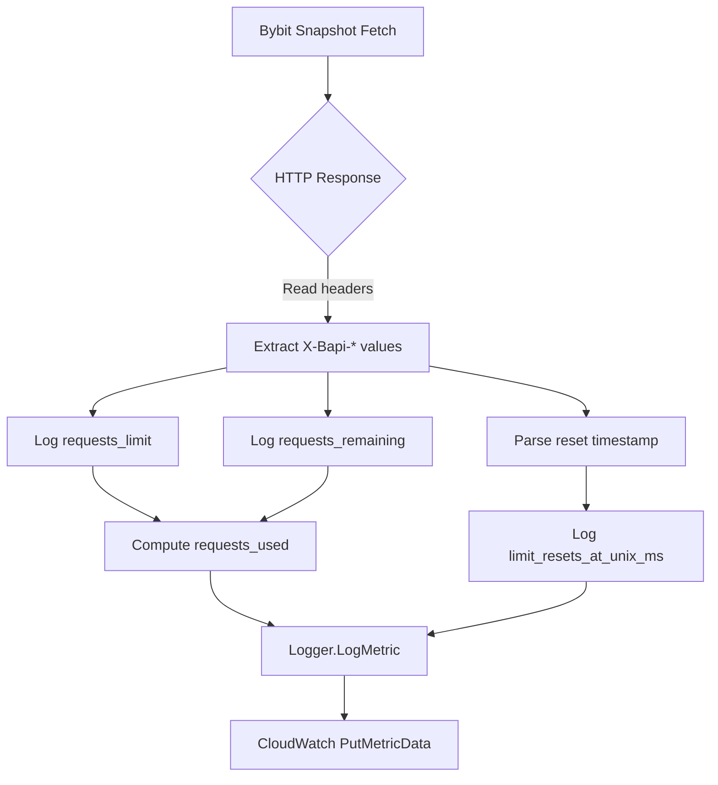

# Bybit Futures Request Usage Metrics

This metric family captures Bybit REST rate-limit headers for futures order-book snapshots. Websocket deltas are excluded because Bybit documents that websocket traffic is not counted toward REST throttling.

## Metric Overview

- `requests_limit` – the per-window quota reported through `X-Bapi-Limit`.
- `requests_remaining` – remaining calls within the current window (`X-Bapi-Limit-Status`).
- `requests_used` – computed as `requests_limit - requests_remaining`, floored at zero.
- `limit_resets_at_unix_ms` – reset timestamp from `X-Bapi-Limit-Reset-Timestamp`, expressed in Unix milliseconds for dashboard alignment.

All metrics include these CloudWatch dimensions:

- `component`: `bybit_reader`
- `exchange`: `bybit`
- `market`: `future-orderbook-snapshot`
- `symbol`: the contract for the snapshot request
- `ip` (optional): populated when the reader is bound to a local address

## Snapshot Sampling

Bybit snapshots are issued over REST at the interval defined in `config/config.yml` (`source.bybit.future.orderbook.snapshots.interval_ms`). Each response triggers header inspection and metric logging. Because the websocket diff stream does not contribute to REST rate limits, no additional estimate is added.

## Flow Diagram

## Operational Guidance

- Alert when `requests_remaining` approaches zero to avoid HTTP 429 responses.
- Track `limit_resets_at_unix_ms` across workers; unexpected drift can indicate network latency or clock skew.
- Combine with websocket-specific health metrics (e.g., reconnect counters) to form a comprehensive Bybit ingestion dashboard.
