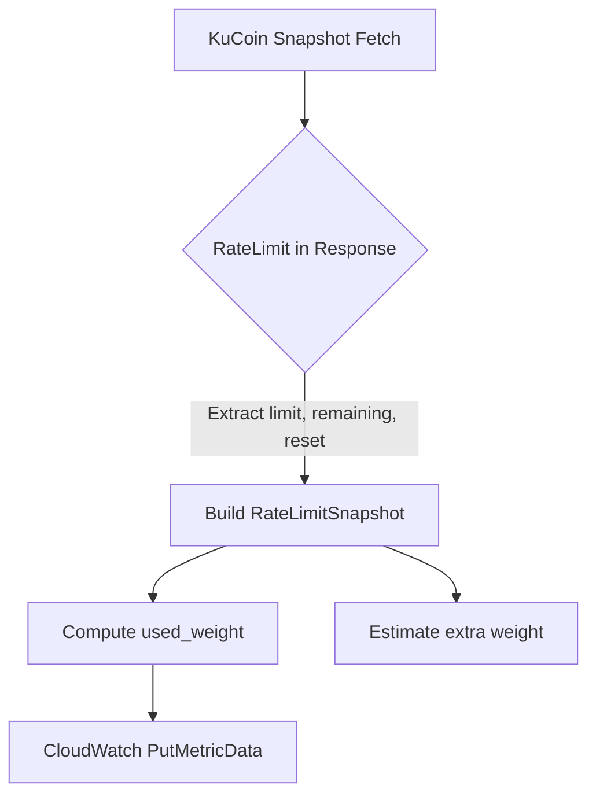

# KuCoin Futures Used Weight Metrics

This document details how CryptoFlow tracks KuCoin REST usage for order-book ingestion and estimates additional load derived from diff-stream activity.

## Metric Overview

| Metric | Description |
|--------|-------------|
| `request_weight_limit` | Window quota reported by KuCoin (weight units). |
| `request_weight_remaining` | Remaining weight within the same window. |
| `used_weight` | Consumed weight attributed to snapshot calls (`weight_per_call` × requests_used). |
| `used_weight_estimated_extra` | Heuristic load for incremental updates (partial depth). |
| `used_weight_total_estimate` | Sum of measured weight and estimated extra load. |
| `limit_resets_at_unix_ms` | Reset timestamp converted to Unix milliseconds. |
| `weight_per_call` | KuCoin documented weight for the sampled endpoint. |

All metrics are tagged with the following dimensions:

- `component`: `kucoin_reader`
- `exchange`: `kucoin`
- `market`: `future-orderbook-snapshot`
- `symbol`: canonical symbol (as mapped by `symbols.ToBinance`)
- `ip` (optional): populated when the reader binds to a specific local address

## Weight Model

- Full snapshot (`/api/v1/level2/snapshot`) → weight per call: **3**
- Partial depth (`/api/v1/level2/depth{20|100}`) → weight per call: **5**

Snapshot polling uses the first figure, while the second acts as a guardrail for any follow-up partial pulls or gap-filling strategies. When both are enabled the reader applies:

```
snapshot_weight_per_min = (1000 / snapshot_interval_ms) * symbols * 60 * 3
partial_weight_per_min  = (1000 / delta_interval_ms) * symbols * 60 * 5
```

Each worker reports a per-symbol share of the estimated partial load so totals can be aggregated in CloudWatch.

## Flow Diagram



## Operational Guidance

- Alert when `request_weight_remaining` trends toward zero; KuCoin bans IPs that exceed weight soft limits repeatedly within 30 seconds.
- Use `used_weight_total_estimate` to forecast load when onboarding new symbols—if the estimate approaches 666 weight units per 30 seconds, scale out with IP sharding.
- Pair these metrics with websocket health indicators to detect divergence between REST refreshes and incremental feeds.
