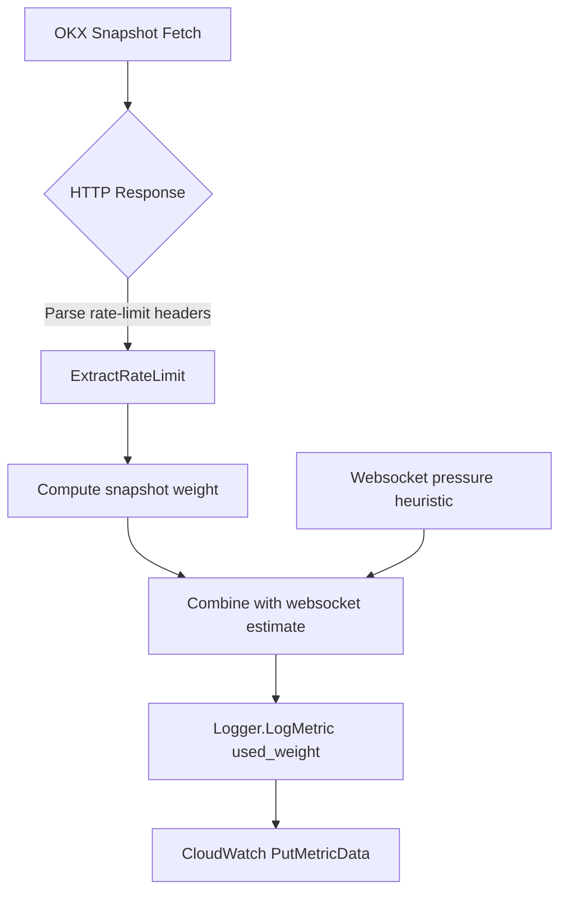

# OKX Swap Used Weight Metrics

CryptoFlow captures OKX REST rate-limit headers for the full-depth swap order-book snapshot endpoint and combines them with websocket update estimates to publish a single load metric.

## Metric Overview

| Metric | Description |
|--------|-------------|
| `used_weight` | Combined OKX weight usage from REST snapshots and websocket update estimates. |

Dimensions attached to the metric:

- `component`: `okx_reader`
- `exchange`: `okx`
- `market`: `swap-orderbook-snapshot`
- `symbol`: OKX instrument ID
- `ip` (optional): present when the reader binds to a local IP

## Usage Model

- REST snapshots (`/api/v5/market/books-full`) → 10 requests per 2 seconds per IP.
- Websocket connection attempts (`wss://ws.okx.com:8443/ws/v5/public`) → 3 per second per IP.

Given configured polling interval `interval_ms` and symbol count `n`, the reader estimates:

```
rest_weight_per_min = (1000 / interval_ms) * n * 60 * 1
ws_pressure_per_min = (3 * 60) / active_connections
per_symbol_ws = ws_pressure_per_min / n
```

The measured REST usage and websocket estimate are summed and emitted as `used_weight`.
## Flow Diagram



## Operational Guidance

- Monitor `used_weight` to decide when to shard OKX polling across additional IPs.
- Track websocket reconnect attempts alongside `used_weight` to catch situations where the diff stream nears connection limits.