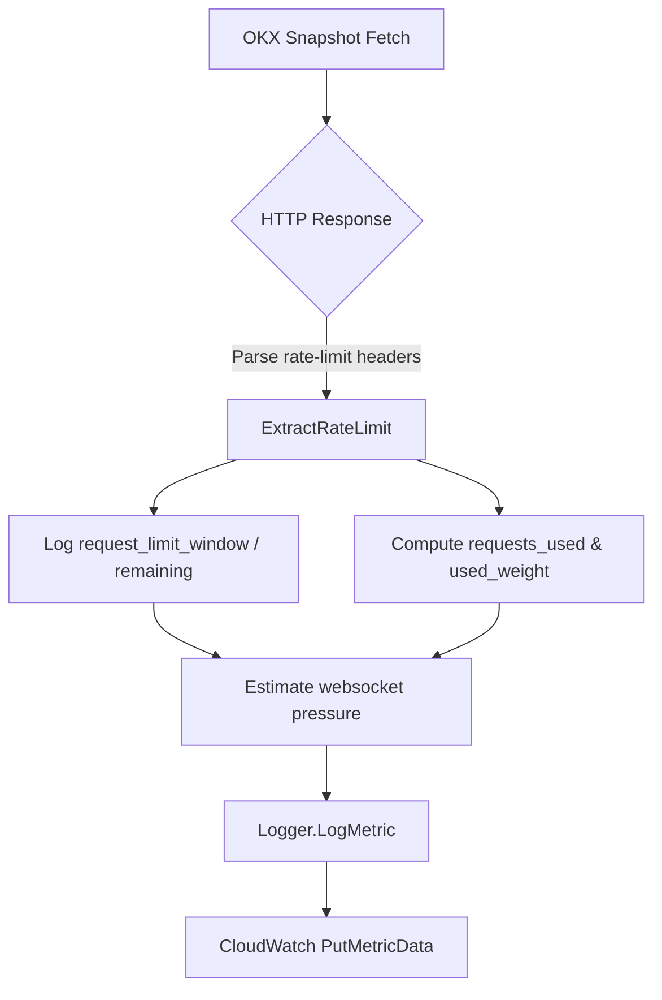

# OKX Swap Used Weight Metrics

CryptoFlow captures OKX REST rate-limit headers for the full-depth swap order-book snapshot endpoint and projects additional load from websocket connection constraints.

## Metric Overview

| Metric | Description |
|--------|-------------|
| `request_limit_window` | Snapshot of the current REST quota (requests per window) from `Rate-Limit-Limit`. |
| `request_remaining_window` | Remaining allocation before the window resets (`Rate-Limit-Remaining`). |
| `requests_used_window` | Derived usage (`limit - remaining`). |
| `used_weight` | Requests used multiplied by the documented weight-per-request (1). |
| `used_weight_estimated_extra` | Heuristic websocket connection pressure (connection limit × 60 ÷ active connections ÷ symbols). |
| `used_weight_total_estimate` | Combined REST weight and websocket estimate. |
| `limit_resets_at_unix_ms` | Reset timestamp converted to Unix milliseconds. |
| `limit_window_seconds` | Effective window length from `Rate-Limit-Interval`. |
| `weight_per_call` | Snapshot weight used for calculations (defaults to 1). |

Dimensions attached to every metric:

- `component`: `okx_reader`
- `exchange`: `okx`
- `market`: `swap-orderbook-snapshot`
- `symbol`: OKX instrument ID
- `ip` (optional): present when the reader binds to a local IP

## Usage Model

- REST snapshots (`/api/v5/market/books-full`) → 10 requests per 2 seconds per IP.
- Websocket connection attempts (`wss://ws.okx.com:8443/ws/v5/public`) → 3 per second per IP.

Given configured polling interval `interval_ms` and symbol count `n`, the reader estimates:

```
rest_weight_per_min = (1000 / interval_ms) * n * 60 * 1
ws_pressure_per_min = (3 * 60) / active_connections
per_symbol_ws = ws_pressure_per_min / n
```

The per-symbol websocket estimate is combined with measured REST usage to form `used_weight_total_estimate`.

## Flow Diagram



## Operational Guidance

- Alert when `request_remaining_window` consistently approaches zero; exceeding the 10/2s rule triggers HTTP 429s.
- Monitor `used_weight_total_estimate` to decide when to shard OKX polling across additional IPs.
- Track websocket reconnect attempts alongside `used_weight_estimated_extra` to catch situations where the diff stream nears connection limits.
