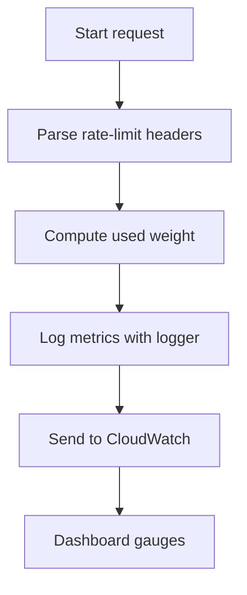
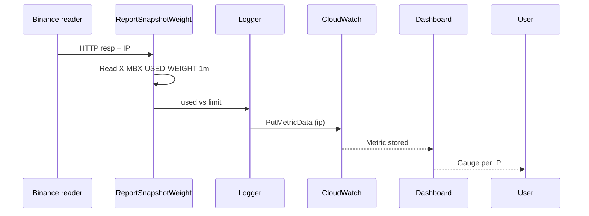
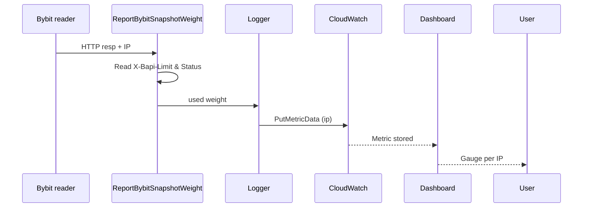
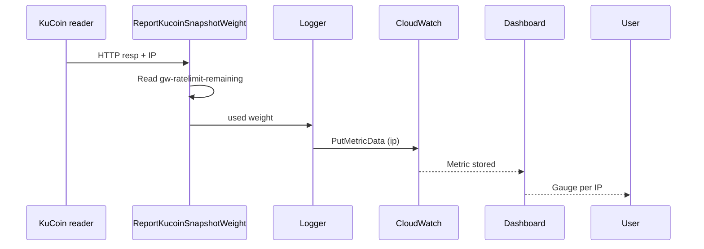
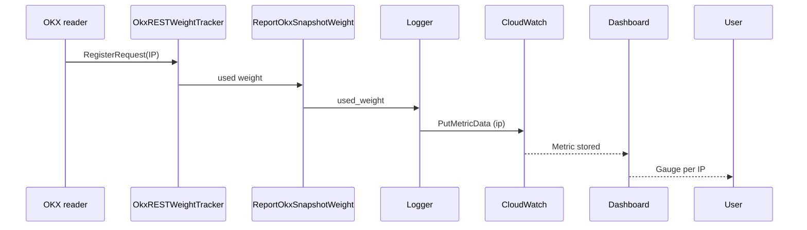

# Rate Limit Metrics

The `rate` package collects per‑IP rate‑limit usage for every supported exchange.
Readers call its helpers after each REST or WebSocket request to capture how many
requests have been consumed by that address.

1. **Configuration** – Free‑tier limits are declared in `config.yml` under
   `exchange_rate_limit` (e.g. Binance `REQUEST_WEIGHT: 2400`). These values become
   the gauge maximum on the CloudWatch dashboard.
2. **IP Shards** – Nine Elastic IPs are listed in `config/ip_shards.yml`. Each
   reader passes its bound IP to the rate helpers so metrics can be emitted and
   visualised per address.
3. **Capture** – Functions such as `ReportSnapshotWeight` (Binance) or
   `ReportKucoinSnapshotWeight` parse the weight headers and compute the `used`
   quota for that IP.
4. **Log** – Metrics are logged via `logger.LogMetric` with the exchange component
   and IP dimension.
5. **Publish** – The logger forwards numeric metrics to CloudWatch using
   `PutMetricData`.
6. **Visualize** – Dashboard gauge widgets plot `used_weight` against the
   configured maximum to show current utilisation per IP.

## Flow

## Exchange Data Sequences

### Binance

Each REST or websocket request is bound to one of the nine shard IPs. The reader
passes that IP to `ReportSnapshotWeight`, which compares Binance’s
`X-MBX-USED-WEIGHT-1m` header against the configured per‑IP limit.

### Bybit

Bybit readers forward the originating IP so `ReportBybitSnapshotWeight` can
record usage against that address using the `X-Bapi-Limit` headers.

### KuCoin

`ReportKucoinSnapshotWeight` receives the shard IP and subtracts the
`gw-ratelimit-remaining` header from the configured limit to compute usage per
address.

### OKX

OKX snapshot readers register each request with an `OkxRESTWeightTracker` tied
to the IP; metrics are emitted from `ReportOkxSnapshotWeight` for that address.

