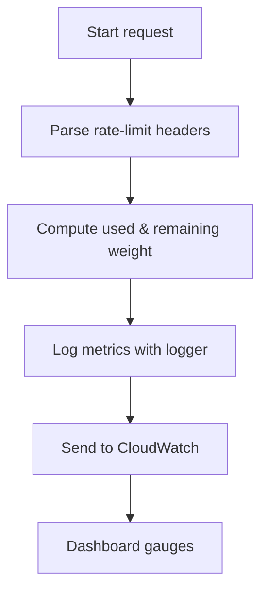
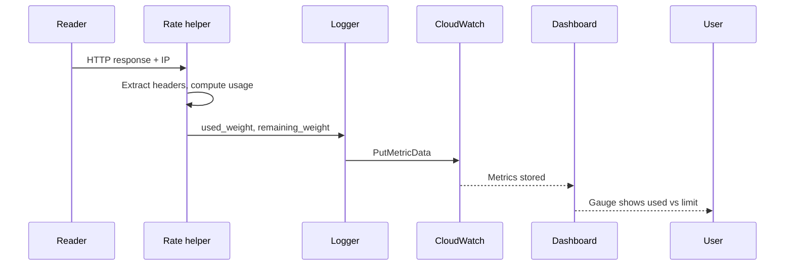

# Rate Limit Metrics

The `rate` package collects per‑IP rate‑limit usage for every supported exchange.
Readers call its helpers after each REST or WebSocket request to capture how many
requests have been consumed and how many remain.

1. **Configuration** – Free‑tier limits are declared in `config.yml` under
   `exchange_rate_limit` (e.g. Binance `REQUEST_WEIGHT: 2400`). These values become
   the gauge maximum on the CloudWatch dashboard.
2. **Capture** – Functions such as `ReportSnapshotWeight` (Binance) or
   `ReportKucoinSnapshotWeight` parse the weight headers and compute `used` and
   `remaining` quotas.
3. **Log** – Metrics are logged via `logger.LogMetric` with the exchange component
   and IP address.
4. **Publish** – The logger forwards numeric metrics to CloudWatch using
   `PutMetricData`.
5. **Visualize** – Dashboard gauge widgets plot `used_weight` against the
   configured maximum to show current utilisation.

## Flow

## Data Sequence

